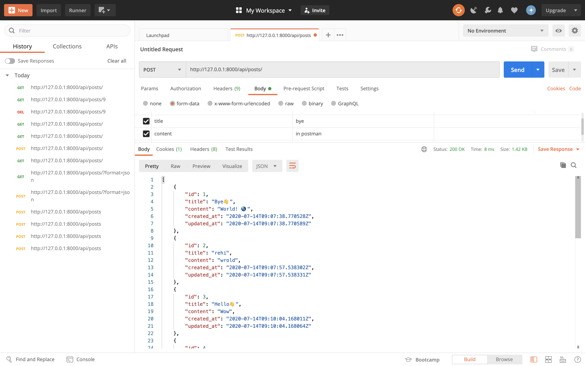

# django-backend

## Install
해당 프로젝트로 이동해서 필요한 것들을 다운로드 해주세요.
```
pip3 install django
pip3 install djangorestframework
pip3 install django-cors-headers
```

## startproject & startapp
프로젝트와 해당 프로젝트 내에 앱을 만들어주세요.
```
django-admin startproject api_project
django-admin startapp api_app
```

## settings.py
`settings.py`에 들어가서 해당 앱을 등록해주세요.

```
INSTALLED_APPS = [
  ...
  'api_app.apps.ApiAppConfig',
]
```
## models.py
`models.py`에 들어가서 해당 모델 class를 만들어주세요.

```
from django.db import models

class Post(models.Model) {
  title = models.CharField(max_length=30)
  content = models.TextField()
  created_at = models.DateTimeField(auto_now_add=True)
  updated_at = models.DateTimeField(auto_now=True)

  def __str__(self):
    return self.title
}
```

## migration
  DB 마이그레이션을 합니다.

```
python3 manage.py makemigrations
python3 manage.py migrate
```

## serializer
queryset과 model 인스턴스 등의 복잡한 데이터를 json, xml 등 다른 콘텐츠 유형으로 파싱해줍니다.    
받은 데이터의 유효성 검사 후 `serializer`를 합니다.

```
from rest_framework import serializers
from .model import Post

class PostSerializer(serializers.ModelSerializer):
  class Meta:
    model = Post
    fields = '__all__'
```

## view
rest_framework는 공통적인 view 로직(crud)을 그룹화한 viewset을 제공합니다. 

```
from rest_framework import viewsets
from .serializers import PostSerializer
from .models import Post

class PostViewSet(viewsets.ModelViewSet):
  queryset = Post.objects.all()
  serializer_class = PostSerializer
```

## uri
rest_framework는 url를 자동으로 매핑해주는 router를 제공합니다. viewset과 router를 연결해주면 자동으로 매핑됩니다.

```
from django.conf.urls import url, incloud
from django.contrib import admin
from rest_framework import routers
from api_app import PostViewSet

router = routers.DefaultRouter()
router.register('posts', PostViewSet) # prefix = posts, viewset = PostViewSet

urlpatterns = [
  url('admin/', admin.site.urls),
  url('api/', incloud(router.urls)),
]
```

## API명세
|URL|METHOD|Description|Params|Return|
|---|---|---|---|---|
|/api/posts|`GET`|전체 글을 조회합니다.||[...{Post}]|
|/api/posts|`POST`|새로운 글을 작성합니다.|{title:'',content:''}|{Post}|
|/api/posts/[id]|`GET`|특정 id의 글을 조회합니다.||{Post}|
|/api/posts/[id]|`DELETE`|특정 id의 글을 삭제합니다.|||

```
api/ ^posts/$ [name='post-list']    
api/ ^posts\.(?P<format>[a-z0-9]+)/?$ [name='post-list']    
api/ ^posts/(?P<pk>[^/.]+)/$ [name='post-detail']   
api/ ^posts/(?P<pk>[^/.]+)\.(?P<format>[a-z0-9]+)/?$ [name='post-detail']   
api/ ^$ [name='api-root']   
api/ ^\.(?P<format>[a-z0-9]+)/?$ [name='api-root']    
```

## run
```
python3 manage.py runserver
```

## API 테스트

### django-rest-framework
<br/> <br/>
<br/> <br/>
<br/> <br/>

### postman
<br/> <br/>
<br/> <br/>
<br/> <br/>


:smile: