# 동적메모리할당

c 언어에서는 malloc() 사용

`malloc()`은 메모리 할당 성공하면 주소를 반환하고,  
실패하면 `null`을 반환한다.
`<stdlib.h>`라이브러리에 있다.

동적 메모리 할당 수행할 때마다 할당되는 포인터 주소는 변칙적이다.

동적 할당 변수 `free()`로 메모리 할당 해제 해주어야 한다.

## 동적으로 문자열 처리

- 일관적인 범위의 메모리 특정 값 설정: `memset(포인터, 값, 크기)` in `<string.h>`

### 동적으로 2차원 배열 생성

```c
int **p = malloc(sizeof(int*) * 3);
for (int i = 0; i < 3; i++) {
    *(p + i) = malloc(sizeof(int) * 3);
}

for (int i = 0; i < 3; i++) {
    for (int j = 0; j < 3; j++) {
        *(*(p + i) + j) = i * 3 + j;
    }
}
for (int i = 0; i < 3; i++) {
    for (int j = 0; j < 3; j++) {
        printf("%d",*(*(p + i) + j));
    }
    printf("\n");
}
```

#### 동적 2차원 배열 할당과 메모리 구조



`int **p = malloc(sizeof(int*) * 3);`의 `int*` 8bytes 이고,  
이유는 포인터는 8bytes를 받기 때문이다.(64-컴퓨터 기준)  
8bytes로 동적으로 할당된 배열의 주소를 받는다.  
그러므로 8bytes의 3배를 받아서, 2차원배열의 각 열에 해당하는 동적 할당 배열의 주소를 받는다.

`*(p + i) = malloc(sizeof(int) * 3);`의 `int`는 4bytes이다.
int 형을 받을 수 있는, 3개의 공간을 할당 받고 이는 2차월 배열의 열에 해당한다.

```c
for (int i = 0; i < 3; i++) {
    for (int j = 0; j < 3; j++) {
        *(*(p + i) + j) = i * 3 + j;
    }
}
```


