# Pointer

1. 변수 선언 시 에스터리스크(\*)

   - 포인터 선언으로 해당 변수가 가리키는 주소를 담는다.
   - `int *p = &a;`
   - 

2. (변수 선언) 이후에 에스터리스크(\*) 사용
   - 이 때 사용하는 에스터리스크를 `간접참조연산자`라고 한다.
     - 변수가 가리키는 주소의 값(value)을 나타낸다는 의미이다.
   - 해당 변수가 가리키는 주소에 있는 값을 나타낸다.
   - `printf("%d", *p);`
   - 

```c
int a = 5;
int* p = &a;

printf("a value of var p is %lu", p);
printf("\n");
printf("a address of var a %lu", &a);
printf("\n");
printf("a address of var p %lu", &p);
printf("\n");

// a value of var p is 140732920755148
// a address of var a 140732920755148
// a address of var p 140732920755136
```

## pointer 관련 연산자

- 주소 연산자 (&)

  - 변수 앞에 붙으며, 변수의 메모리 시작 주소를 의미한다.

- 포인터 (\*)

  - 선언하는 변수 앞에 붙으며, 들어오는 값을 주소로 인식하고 받는다.

- 간접참조 연산자(\*)
  - 가리키고 있는 주소에 잇는 값을 나타낸다.

## 다중 포인터

```c
int a = 5;
int *b = &a;
int **c = &b;
```

여기서 `**c`는 포인터 b의 주소를 담고 있는 변수, 포인터의 포인터이다.  
`&a`를 가리키는 `*b`을 가리킨다.  
그러므로, `**c`는 포인터 b가 가리키고 있는 변수의 주소의 값으로, 5이다.

```c
int a = 5;
int *b = &a;
int **c = &b;

printf("a value of var p is %lu", b);
printf("\n");
printf("a address of var a %lu", &a);
printf("\n");
printf("a address of var p %lu", &b);
printf("\n");
printf("a value of var *c %lu", *c);
printf("\n");
printf("a value of var c %lu", c);
printf("\n");

// a value of var b is 140732920755148
// a address of var a 140732920755148
// a address of var b 140732920755136
// a value of var *c 140732920755148
// a value of var c 140732920755136
```

`c`는 `&b` 즉, b의 주소를 가리키고 있고,  
`*c`는 `b`의 값(value) 즉, a의 주소를 가리키고 있다.


