# 컴퓨터 변수 처리

## 일반적 컴퓨터 OS 메모리 공간



### 레지스터 변수

1. 메인 메모리대신 CPU 의 레지스터를 사용하는 변수
2. 처리속도가 빠르다.
3. 레지스터 매우 한정적 -> 레지스터에서 처리될지 장담할 수 없다.
4. `register int a = 10;`

### 함수 매개 변수 처리

1. 값에 의한 전달
   - 함수 내에서 변수가 새롭게 만들어지고 해제된다.
2. 참조에 의한 전달
   - 주소를 참조해서 기존 값을 가지고 있기에 값을 변경할 수 있다.
   ```c
   // params 에서 *는 포인터 사용 의미
   void add(int* a){
   // 가리키는 주소에 있는 값 의미
       *a = *a + 10;
   }
   int main(void){
       int a = 7;
       add(&a);
   }
   ```

### 포인터와 배열

배열과 포인터가 완전 같은 건 아니고, 굉장히 동일하게 작동한다.

- 차이점
  - 배열 이름
    - 주소 못 바꿈
  - 포인터 변수
    - 주소 변경 가능

배열 주소 변경

```c
int a = 10;
int b[10];
b = *a;
// 오류 발생 -> 상수인 배열 주소 변경 x
```

배열 주소 포인터로 받기

```c
int a[1] = {0};
int *b = a;
// 배열 이름은 배열[0]의 주소와 같다
// int *b = &a[0];
```

#### 포인터 연산

자료형 만금씩 이동한다.  
예를 들어 int 형이라면 4bytes 식 이동한다.

그렇기 때문에 `a[1] == *(a + 1)` 이 될 수 있다.

```c
int a[4] = {1,2,3,4};
int *p = a;
*(p++); // 1
*(++p); //3
```

위 결과로 알 수 있듯이, 후위 연산자는 포인터 연산보다 뒤에 이뤄진다.
