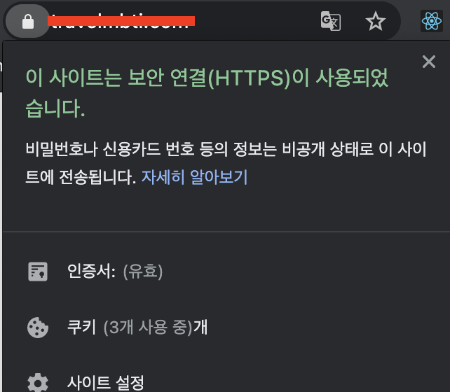

# HTTPS SSL 인증서 Lets Encrypt 받기 CentOS7 Nginx

[CentOS 7 : Nginx에 Let’s Encrypt로 HTTPS, SSL 적용하기](https://jjeongil.tistory.com/842#recentComments)
정리 및 추가 내용

Let Encryption은 ISRG(Internet Security Research Group)에서 개발한 무료 개방형 인증 기관입니다. Let’s Encrypt에서 발급한 인증서는 오늘날 거의 모든 브라우저에서 신뢰된다.

## Cerbot 설치

Cerbot은 Let’s SSL 인증서 획득 및 갱신, 웹서버 구성 작업을 자동화 할 수 있는 도구

EPEL 리포지토리에서 Cerbot 설치

```
sudo yum install certbot
```

## String DH(Diffie-Hellman) 그룹 생성

2048 비트 DH 매개변수 집합을 생성한다.

```
sudo openssl dhparam -out /etc/ssl/certs/dhparam.pem 2048
```

이렇게 하면 `/etc/ssl/certs/` 에 `dhparam.pem`가 저장된다.  
다른 곳에 저장해도 상관 없다. 후에 `nginx` 설정할 때 `ssl_dhparam` 가저올 때 경로만 잘 설정해주면 된다.

추가로 4096비트까지 변경할 수 있으나 시간이 오래걸린다고 한다.

## SSL 암호화 인증서 가져오기

- 도메인에 대한 인증서를 얻기 위해서는 `[path]/.well-known/acme-challenge`에서 요청된 도메인의 유효성을 검사
- 이 검사하기위해 Webroot 플러그인을 사용 (검사 위함 임시파일 생성, 작동)
- 그리고 이 임시파일에 HTTP 요청을 하고 도메인 확인

위와 같은 과정을 거치는데, 이를 간단히 하기 위해, `.well-know/acme-challenge`에 대한 모든 HTTP요청을 `/var/lib/letsencrypt/` 에 매핑한다.

```
sudo mkdir -p /var/lib/letsencrypt/.well-known
sudo chgrp nginx /var/lib/letsencrypt
sudo chmod g+s /var/lib/letsencrypt
```

- `.well-known` 이라는 디렉토리 만들고,
- `/var/lib/letsencrypt`의 소유 그룹을 nginx 로 설정한 후,
- 이 디렉터리를 사용하는 사용자가 설정된 그룹(nginx) ID를 사용하도록 허용.
  - 즉, 이 디렉터리의 소유 그룹 ID 를 설정하는 것이고, 이는 이 디랙터리와 그 아래 있는 모든 파일과 디랙터리가 이 디랙터리의 그룹 ID(nginx)를 상속받는다.

Nginx 서버 블록 파일에 포함될 공통 SSL 관련 코드들을 2개의 conf파일로 만든다.
이 역시 경로는 상관없다. Nginx에서 가져올 때 경로만 정확히 적어주면 된다.

```
sudo mkdir /etc/nginx/snippets
vi /etc/nginx/snippets/letsencrypt.conf
```

```
location ^~ /.well-known/acme-challenge/ {
  allow all;
  root /var/lib/letsencrypt/;
  default_type "text/plain";
  try_files $uri =404;
}
```

- `.well-known/acme-chllenge`에 대한 모든 요청을 `/var/lib/letsencrypt/` 으로 매핑한 후

```
vi /etc/nginx/snippets/ssl.conf
```

```
ssl_dhparam /etc/ssl/certs/dhparam.pem;

ssl_session_timeout 1d;
ssl_session_cache shared:SSL:50m;
ssl_session_tickets off;

ssl_protocols TLSv1 TLSv1.1 TLSv1.2;
ssl_ciphers 'ECDHE-ECDSA-CHACHA20-POLY1305:ECDHE-RSA-CHACHA20-POLY1305:ECDHE-ECDSA-AES128-GCM-SHA256:ECDHE-RSA-AES128-GCM-SHA256:ECDHE-ECDSA-AES256-GCM-SHA384:ECDHE-RSA-AES256-GCM-SHA384:DHE-RSA-AES128-GCM-SHA256:DHE-RSA-AES256-GCM-SHA384:ECDHE-ECDSA-AES128-SHA256:ECDHE-RSA-AES128-SHA256:ECDHE-ECDSA-AES128-SHA:ECDHE-RSA-AES256-SHA384:ECDHE-RSA-AES128-SHA:ECDHE-ECDSA-AES256-SHA384:ECDHE-ECDSA-AES256-SHA:ECDHE-RSA-AES256-SHA:DHE-RSA-AES128-SHA256:DHE-RSA-AES128-SHA:DHE-RSA-AES256-SHA256:DHE-RSA-AES256-SHA:ECDHE-ECDSA-DES-CBC3-SHA:ECDHE-RSA-DES-CBC3-SHA:EDH-RSA-DES-CBC3-SHA:AES128-GCM-SHA256:AES256-GCM-SHA384:AES128-SHA256:AES256-SHA256:AES128-SHA:AES256-SHA:DES-CBC3-SHA:!DSS';
ssl_prefer_server_ciphers on;

ssl_stapling on;
ssl_stapling_verify on;
resolver 8.8.8.8 8.8.4.4 valid=300s;
resolver_timeout 30s;

add_header Strict-Transport-Security "max-age=15768000; includeSubdomains; preload";
add_header X-Frame-Options SAMEORIGIN;
add_header X-Content-Type-Options nosniff;
```

- nginx에 공통으로 사용될 SSL 관련 코드를 모아준다.
  - ssl protocol, ssl session, resolver, header 등,,

```
vi /etc/nginx/conf.d/example.com.conf
```

```
server {
  listen 80;
  server_name example.com www.example.com;

  include snippets/letsencrypt.conf;
}
```

- `example.com.conf` 라는 파일을 만들어 nginx 설정
  - http (port 80)
  - 도메인은 example.com 호스트 www. 포함 (www. 로 들어오는 요청을 non www. 로 리턴해주기 위해)
  - 위에 `.well-known/acme-chllenge`에 대한 모든 요청을 `/var/lib/letsencrypt/` 으로 매핑했던 `snippets/letsencrypt.conf` 를 include 해준다.

그 후 nginx 를 다시 로드 해준다.

```
sudo systemctl reload nginx
```

Webroot 플러그인으로 Cerbot을 실행하고, 도메인의 SSL 인증서 파일을 가져오기

```
sudo certbot certonly --agree-tos --email admin@example.com --webroot -w /var/lib/letsencrypt/ -d example.com -d www.example.com
```

- non www 와 www, 두가지 호스트를 가진 도메인을 사용하므로 둘 다 적어준다.

SSL 인증서를 성공적으로 획득한 경우 certbot은 다음 메시지를 인쇄합니다.

```
IMPORTANT NOTES:
 - Congratulations! Your certificate **and** chain have been saved at:
   /etc/letsencrypt/live/example.com/fullchain.pem
   Your key file has been saved at:
   /etc/letsencrypt/live/example.com/privkey.pem
   Your cert will expire on 2021-xx-xx. To obtain a new **or** tweaked
   Version of this certificate **in** the future, simply run certbot
   Again. To non-interactively renew *all* of your certificates, run
   “certbot renew”
 - If you like Certbot, please consider supporting our work by:

   Donating to ISRG / Let’s Encrypt:   https://letsencrypt.org/donate
   Donating to EFF:                    https://eff.org/donate-le
```

이제 인증서 파일이 있으므로 도메인 서버 블록 편집

```
vi /etc/nginx/conf.d/example.com.conf
```

```
server {
 listen 80;
 server_name example.com www.example.com;
 include /etc/nginx/snippets/letsencrypt.conf;
 return 301 https://example.com$request_uri;
}

server {
    listen 443 ssl;
    server_name www.example.com;

    ssl_certificate /etc/letsencrypt/live/example.com/fullchain.pem;
    ssl_certificate_key /etc/letsencrypt/live/example.com/privkey.pem;
    ssl_trusted_certificate /etc/letsencrypt/live/example.com/chain.pem;
    include /etc/nginx/snippets/ssl.conf;
    include /etc/nginx/snippets/letsencrypt.conf;

    return 301 https://travelmbti.com$request_uri;
}

server {
    listen 443 ssl;
    server_name travelmbti.com;

    ssl_certificate /etc/letsencrypt/live/example.com/fullchain.pem;
    ssl_certificate_key /etc/letsencrypt/live/example.com/privkey.pem;
    ssl_trusted_certificate /etc/letsencrypt/live/example.com/chain.pem;
    include /etc/nginx/snippets/ssl.conf;
    include /etc/nginx/snippets/letsencrypt.conf;
    location / {
     root   /home/app/client/react_app/build;
     index  index.html index.htm;
     try_files $uri $uri/ /index.html;
    }
}

```

- http와 www 를 non www로 리다이렉션한다.
- 공통 ssl 관련 파일을 가져온다 `snippets/*`
- `/etc/letsencrypt/live/` 뒤에 오는 디렉터리 이름은
  - `sudo certbot certonly --agree-tos --email admin@example.com --webroot -w /var/lib/letsencrypt/ -d example.com -d www.example.com` 설정할 때 자동 생성된다.

## 만약 도메인 오류가 나거나 실수로 잘못 설정한 경우

`var/lib/letsencrypt/`와 `/etc/letsencrypt`는 연결되어 있다. 이 아래 chain, privacy 등 `sudo certbot certonly --agree-tos --email admin@example.com --webroot -w /var/lib/letsencrypt/ -d example.com -d www.example.com` 설정할 때 자동으로 해당 도메인 이름의 디렉터리 아래에 생성된 인증서 관련 파일들이 있다.
만약 이 과정에서 잘못되었다면,

- `var/lib/letsencrypt/`와 `/etc/letsencrypt`를 `rm -rf`를 통해 두 디렉터리를 삭제한다.
- ##SSL 암호화 인증서 가져오기 로 돌아가

```
sudo mkdir -p /var/lib/letsencrypt/.well-known
sudo chgrp nginx /var/lib/letsencrypt
sudo chmod g+s /var/lib/letsencrypt
```

`/var/lib/letsencrypt`를 디렉터리 만들고, 관련 설정을 다시하고

- 다시 도메인 관련 인증서를 받는다.

```
sudo certbot certonly --agree-tos --email admin@example.com --webroot -w /var/lib/letsencrypt/ -d example.com -d www.example.com
```

- 그리고 `/etc/nginx/conf.d/example.com.conf` 에 관련 디렉터리 이름에 수정된 사항을 설정한다.

```
# 예를 들어
# ssl_certificate /etc/letsencrypt/live/example1.com/fullchain.pem; ->
ssl_certificate /etc/letsencrypt/live/example.com/fullchain.pem;
```

- nginx 재실행하고 아래 자동 갱신 진행하며 테스트 해보기

## 인증서 자동 갱신

인증서는 90간 유효, 만료되기 30일전 전에 자동 갱신하기위해 `cronjob`을 만든다.

Crontab 명령을 실행하여 새 cronjob을 생성

```
sudo crontab -e
```

그리고 아래 코드를 추가한다.

```
0 */12 * * * root test -x /usr/bin/certbot -a \! -d /run/systemd/system && perl -e 'sleep int(rand(3600))' && certbot -q renew --renew-hook "systemctl reload nginx"
```

갱신 프로세스 테스트

```
sudo certbot renew --dry-run
```

오류 없으면 테스트 갱신 프로세스 성공!



#nginx #CentOS7 #SSL #letencrypt #https #오류해결 #자동갱신
