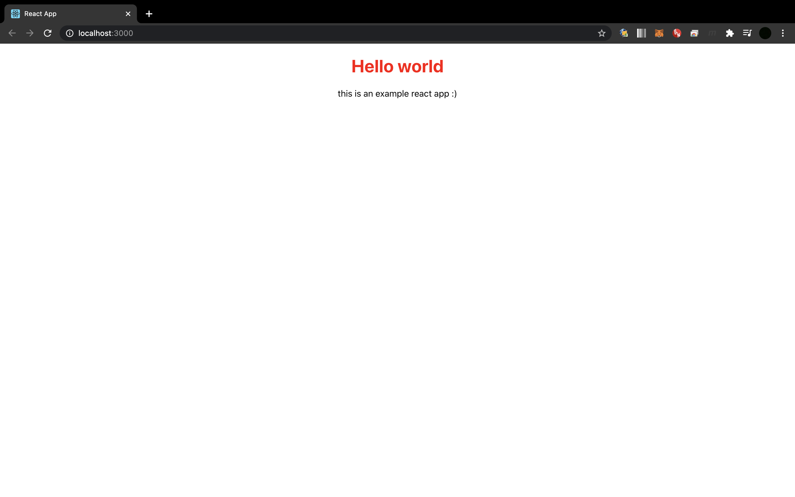

# JSX
컴포넌트에다가 내용을 채워넣는, 뼈대를 만드는 작업과 그 후 꾸미는 작업까지 해야합니다. 흔히 알고있는 HTML과 CSS를 어떻게 자바스크립트에 녹여낼 수 있을지 생각해 봐야합니다.     
이런 것들을 해결하기 위해서 우선적으로 JSX를 알아야 합니다.     
이것은 JavaScript Xml의 약자입니다. 일단 이것은 html과 css 유사합니다.      
JSX의 핵심 특징은
1. 태그 이름은 기존 HTML과 거의 유사합니다.
2. Attributes나 css는 카멜방식입니다. (className, textAlign)
3. JS코드를 활용하고 싶다면 {}를 이용합니다.
중괄호 안에다가 숫자형이든 자바스크립트 코드나 함수를 집어 넣을 수가 있습니다. 
사실 전 doc2.md에서 `App.js` 안에서 사용했던 코드들도 `JSX`입니다. HTML코드와 거의 유사합니다.  
이렇게 거의 유사하기 때문에 스타일 Attributes를 사용할 때 HTML과 똑같이 사용할 수 있으나, 그렇게 하면 코드 에러가 납니다. 
```
<h1 style="color:red">
```
그 이유는 맵핑된 스타일 프로퍼티가 들어가는 것이 아닌 스트링으로 들어가기 때문입니다. 
그래서 아래와 같이 코드를 작성해야 합니다.
```
<h1 style={}>
```
이는 중괄호 안에 자바스크립트 코드가 들어갈 것을 선언하는 것입니다. 그리고 이 안에
```
<h1 style={{color: 'red'}}>
```
위와 같이 다시 중괄호로 묶어서 스타일을 지정해 줍니다. 위와 같이 한번 더 중괄호를 사용하는 이유는 위 중괄호는 자바스크립트 코드를 사용한다는 선언을 하기 위함이라면 안에 있는 중괄호는 자바스크립트의 오브젝트임을 나타냅니다.
```
import React from 'react';
// import logo from './logo.svg';
import './App.css';

function App() {
  return (
    <div className="App">
      <h1 style={{color:'red'}}>Hello world</h1>
      <p>this is an example react app :)</p>
    </div>
  );
}

export default App;
```

혹은 
```
import React from 'react';
// import logo from './logo.svg';
import './App.css';

const myStyle = {color: 'red'}

function App() {
  return (
    <div className="App">
      <h1 style={myStyle}>Hello world</h1>
      <p>this is an example react app :)</p>
    </div>
  );
}

export default App;
```
위와 같이 속성을 따로 변수로 정의해서 사용할 수도 있습니다.
<br/>
 <br/>

하지만 이렇게 자바스크립트를 무분별하게 사용하면 나중에 문제가 생길 수 있기 때문에 이는 클래스로 관리해주는 게 좋습니다.

```
import React from 'react';
// import logo from './logo.svg';
import './App.css';


function App() {
  return (
    <div className="App">
      <h1 className={'myClass'}>Hello world</h1>
      <p>this is an example react app :)</p>
    </div>
  );
}

export default App;
```
위와 같이 `className={'myClass'}`으로 클래스를 하나 만들어줍니다.
그리고 이 클래스는 위에서 `import`하고 있는 `import './App.css` 이곳에서 관리해주고 있기 때문에 `App.css`에서

```
.myClass {
  color: red;
}
```
이렇게 스타일을 지정해주고 `npm start`를 해보면 똑같이 지정되어 있는 것을 확인하실 수 있습니다.