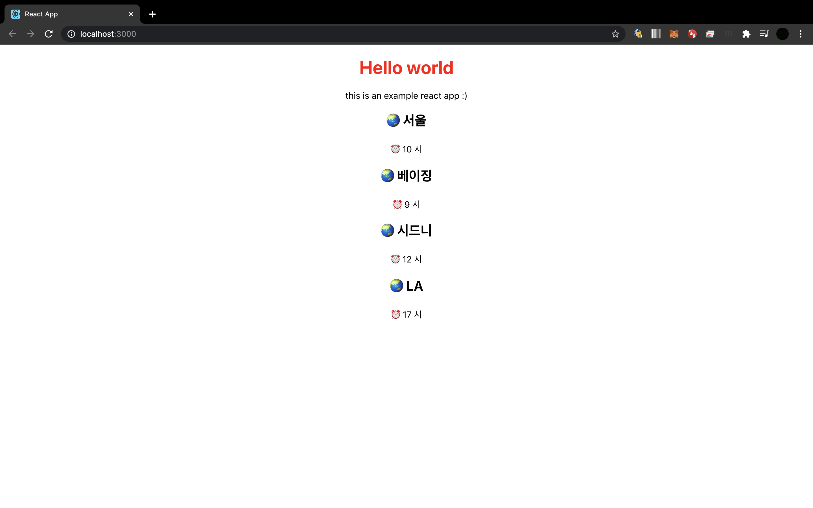

# Props & State

`Props`는 함수 매개변수처럼 컴포넌트 안에서 관리가 된다. `state`는 함수 내에서 선언된 변수처럼 컴포넌트 안에서 관리가 된다.

심리테스트 프로젝트를 예를 들어보면,

- 질문 목록
- 문항 목록
- 여러 컴포넌트에서 공유하는 카운트
- 유저가 선택한 문항
- 결과 값

둘 중 어느 것을 선택하면 좋을지 생각해보자.

1. 변하지 않는 값인가? 즉, `setState`나 `reducer`를 안쓰는지?
2. 부모 컴포넌트로 부터 prop를 받는지?
3. 컴포넌트 안에 다른 state나 props를 가지고 계산하는지?

위 세가지에 해당하면 props이다.
질문, 문항 목록은 변하는 값이 아니기 때문에 props를 사용했다.

여러 컴포넌트에서 공유하는 카운트 기능은 값이 각 컴포넌트 내에서 계속 변하기 때문에 state를 사용했지만, 이 값을 공유하기 위해서 context를 사용했다.

유저가 선택한 문항은 질문 컴포넌트 내에서 들어오는 값을 계속 변화하며 유지하고 있어야 하기 때문에 state를 사용했다.

결과 값은 질문 컴포넌트에서 계산한 값이 결과 컴포넌트로 넘어가기 때문에 props를 사용했다.

React는 유저에게 빠르게 반응합니다. 그럴 수 있는 이유는 컴포넌트 개별로 Re-render가 일어나기 때문입니다. 그러므로 컴포넌트를 잘 기획하고 나누어 작성해야 합니다.  
컴포넌트를 만들기 위해서 가장 중요한 두가지 개념이 `Props`와 `State`입니다.

[참고](https://doubly12f.tistory.com/108?category=859792)

## Props

컴포넌트 간의 이동하는데 있어서 컴포넌트와 컴포넌트 사이에 데이터를 이동하는 역할을 합니다.  
데이터를 `key`와 `value`의 형태로 전달해주는 역할을 합니다. 이 `Props`가 가지는 가장 큰 특징 중 하나가 바로 `Read Only`라는 것입니다. 읽고 쓰기 중 쓰기, 즉 새롭게 바뀔 수 없다는 것입니다. 위에서 오는 `Props`값을 밑에 있는 컴포넌트들이 바꿀 수가 없다는 것입니다. 이 때문에 `State` 필요하게 됩니다. 그리고 이 때문에 `Props`를 따로 저장하는 일도 발생할 수 있습니다. 이러한 이유들로 `Props`의 `Read Only`라는 특징을 가진다는 것이 중요합니다.  
컴포넌트는 `function`으로 선언할 수 있습니다. `App.js`에서 `function`을 선언해 줍니다.
그리고 이 함수의 이름과 파라미터를 적어주고 return해줄 것들을 ()안에 적어줍니다. 이 때 `<div>`로 감싸주시는 것이 좋습니다. 컴포넌트들은 하나의 약속이 있습니다. 최상단에는 하나의 열고 닫음만 있다라는 것입니다. 이는 여러 개의 태그를 하나의 함수 내에서 여러개로 쪼개서 return해줄 수가 없다는 의미입니다. 에를들어,

```
function f(props) {
    return (
        <div>
            ...
        </div>
        <div>
            ...
        </div>
    )
}
```

이런식으로 반환할 수 없다는 얘기입니다.

```
import React from 'react';
// import logo from './logo.svg';
import './App.css';

function WorldClock(props) {
  return (
    <div className={'worldClock'}>
        <h2>🌏 {props.city}</h2>
        <p>⏰ {props.time} 시</p>
    </div>
  )
}

function App() {
  return (
    <div className="App">
      <h1 className={'myClass'}>Hello world</h1>
      <p>this is an example react app :)</p>
      <WorldClock city={'서울'} time={10}/>
      <WorldClock city={'베이징'} time={9}/>
      <WorldClock city={'시드니'} time={12}/>
      <WorldClock city={'LA'} time={17}/>

    </div>
  );
}

export default App;
```

위와 같이 코드를 작성해 보겠습니다. 함수 `WorldClock`을 선언한 후에 함수 `App`에서 사용합니다. 그리고 `city={'서울'}`과 같이 인자값을 적어줍니다.  
상위 컴포넌트인 `App`에서 각각의 `WorldClock` 컴포넌트로 `props`를 통해서 데이터가 전달되고 있다는 것을 확인할 수 있습니다.

 <br/>

## List & Key

여러개의 컴포넌트들의 집합이 있는데, 이것을 단순화해보려고 합니다.
필요한 정보들만 모으고 필요한 정보들을 활용하는 방법에 대해 알아보려 합니다.

`App.js`에 함수 `App`에 `cityTimeData`라는 배열을 하나 생성해 보겠습니다.

```
const cityTImeData = [
    ['서울', 10],
    ['베이징', 9],
    ['시드니', 12],
    ['시드니', 17],
  ]
```

그리고 `cityTimeData`를 매핑해주는 `worldClockList`를 하나 만듭니다.

```
import React from 'react';
// import logo from './logo.svg';
import './App.css';

function WorldClock(props) {
  return (
    <div className={'worldClock'}>
        <h2>🌏 {props.city}</h2>
        <p>⏰ {props.time} 시</p>
    </div>
  )
}

function App() {
  const cityTimeData = [
    ['서울', 10],
    ['베이징', 9],
    ['시드니', 12],
    ['시드니', 17],
  ]
  const worldClockList = cityTimeData.map((props)=>
    <WorldClock city={props[0]} time={props[1]}/>
  )
  return (
    <div className="App">
      <h1 className={'myClass'}>Hello world</h1>
      <p>this is an example react app :)</p>
      {/* <WorldClock city={'서울'} time={10}/>
      <WorldClock city={'베이징'} time={9}/>
      <WorldClock city={'시드니'} time={12}/>
      <WorldClock city={'LA'} time={17}/> */}
      {worldClockList}

    </div>
  );
}

export default App;
```

위와 같이 기존에 있던 여러개의 인자값만 다른 `WorldClock`을 리스트로 만들어서 자바스크립트 문법으로 처리합니다.

그런데 이 앱을 실행시켜보면 아래와 같은 오류 문구가 뜹니다.

```
index.js:1 Warning: Each child in a list should have a unique "key" prop.
```

이는 유니크한 키값을 요구한다는 것인데, 이럴 때는 각 키를 `index`로 받아주면 됩니다.:smile:

```
const worldClockList = cityTimeData.map((props, index)=>
    <WorldClock city={props[0]} time={props[1]} key={index}/>
  )
```

이 map에서 하나의 인자만 넘겨줄 때는 각 값들에 대해서 넘겨주게 되고 두 개 인자로 넘겨줄 때는 인덱스 값을 같이 넘겨주게 됩니다.  
`key`는 리액트가 어떤 아이템이 바뀌고 추가되고 삭제되는지 아는데 굉장히 도움을 준다고 합니다. 리액트는 변화를 최대한 빨리감지해서 최소한의 변화를 주는 것이 핵심인데 어느 부분이 바뀌었는지 정확히 알기위해서 사용되는 것입니다.

## State

각 컴포넌트들이 가질 수 있는 정보의 집합, 그 정보들은 `Props`를 통해서 하위 컴포넌트로 넘길 수 있습니다. 상태는 있을 수도 있고 없을 수도 있습니다. 이 상태라는 것은 비용이 많이드는 문제이기 때문입니다. 그렇기 때문에 웬만해선 필요한 것에만 `State`를 넣어야합니다.  
`state`로 넣는 기준은

1. Props 만으로도 표현할 수 있는지
2. Render로 표시되지 않는 값인지
   이 위 2개에 해당되지 않는다면 State로 넣어야 합니다.

기존에는 `function` 컴포넌트에서는 `state`를 사용할 수 없고, `class`에서만 사용할 수 있었습니다. 하지만 현재는 `hook`이라는 것을 이용해서 `function`에서도 `state`를 사용할 수 있게 되었습니다.  
그럼에도 이전에 웬만한 컴포넌트들은 클래스로 되어이 있고, 이에 따른 라이프사이클도 이해할 수 있어야 `hook`도 이해할 수 있기 때문에 우선 클래스 컴포넌트의 `state`를 다뤄보도록 하겠습니다.

`App.js`에서 클래스를 하나 생성해 줍니다.

`React.Component`는 `props`를 인풋으로 받기 때문에 적어준 것이고 `super()` 이렇게 하면 `React.Component`의 기능을 이용할 수 있습니다.

```
import React from 'react';
// import logo from './logo.svg';
import './App.css';

// function WorldClock(props) {
//   return (
//     <div className={'worldClock'}>
//         <h2>🌏 {props.city}</h2>
//         <p>⏰ {props.time} 시</p>
//     </div>
//   )
// }

function App() {
  const cityTimeData = [
    ['서울', 10],
    ['베이징', 9],
    ['시드니', 12],
    ['시드니', 17],
  ]
  const worldClockList = cityTimeData.map((props, index)=>
    <WorldClock city={props[0]} time={props[1]} key={index}/>
  )
  return (
    <div className="App">
      <h1 className={'myClass'}>Hello world</h1>
      <p>this is an example react app :)</p>
      {worldClockList}
    </div>
  );
}

class WorldClock extends React.Component {
  constructor(props){
    super(props)
    this.state = {
      hour: this.props.time,
      minute: 0
    }
  }
  // 미리 약속된 함수
  render() {
    return (
      <div className={'worldClock'}>
          <h2>🌏 {this.props.city}</h2>
          <p>⏰ {this.state.hour} 시 {this.state.minute} 분</p>
      </div>
    )
  }
}

export default App;
```

그리고 `state`를 이용하기 위해서는 요구사항이 필요합니다. props 만으로 해결이 안되는 것을 추가해주어야 합니다. 예를들어 시간과 분이 동적으로 변화하는 것이 있겠죠.  
동적, 모듈화 방법을 알아보도록하겠습니다.
`state`는 `setState`를 사용해야합니다.
`state`가 변화면 바로 렌더가 일어납니다.

```
class WorldClock extends React.Component {
  constructor(props){
    super(props)
    this.state = {
      hour: this.props.time,
      minute: 0
    }
    setInterval(()=>{
      this.setState((state) => (
        state.minute === 59 //현재 minute이 59라면
        ?{hour: state.hour + 1, minute: 0} // 현재 hour에 +1d을 하고, minute은 0으로
        :{minute: state.minute + 1} //아니면 minute 을 +1

      ))
    }, 1000) //1초 마다
  }
```
