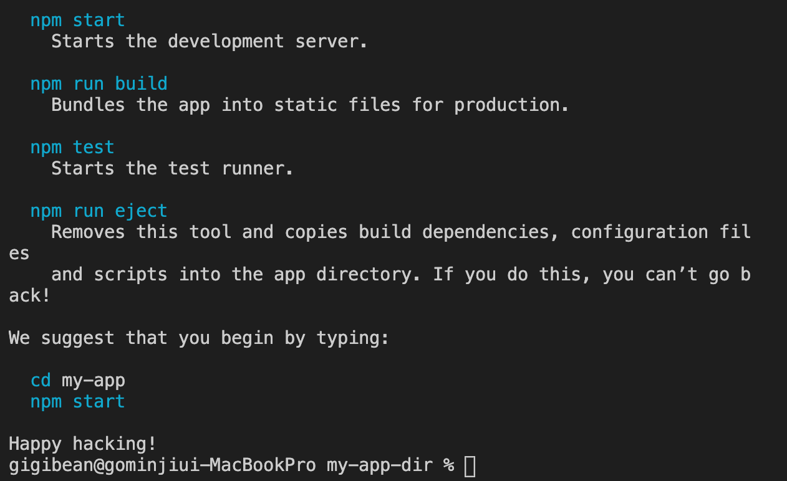
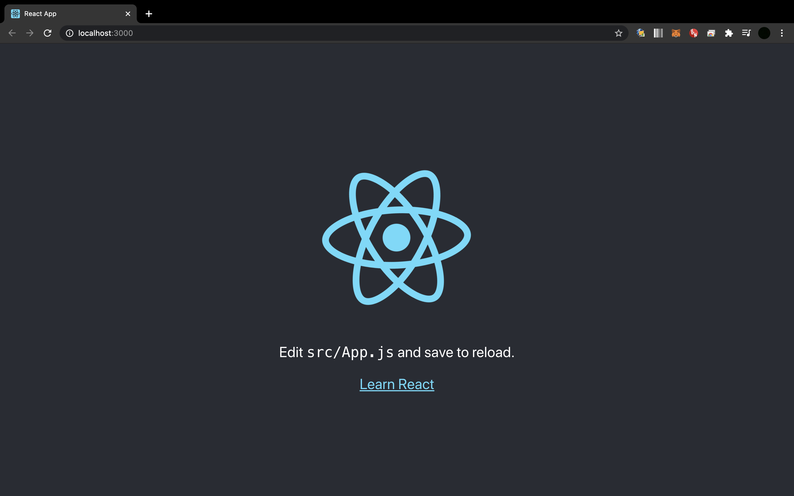
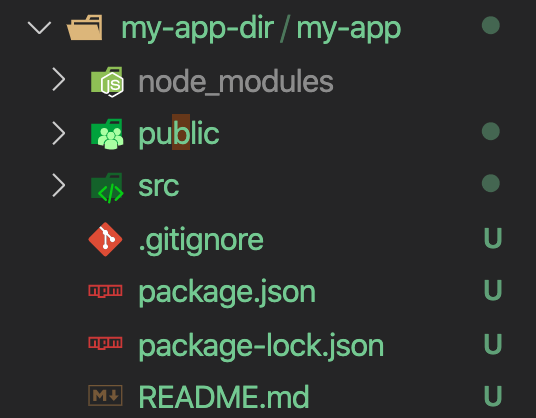
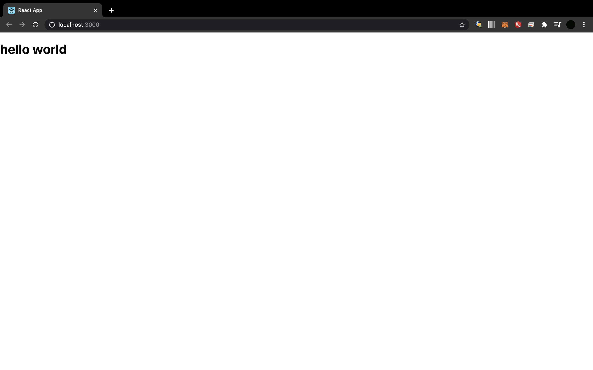
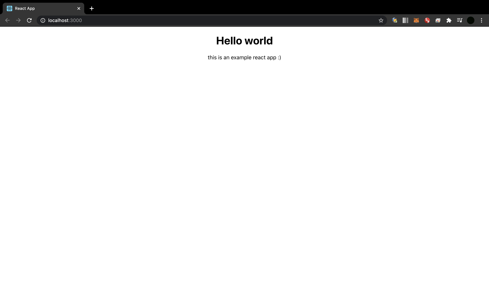

# React 개요
리액트는 Jquery다음으로 웹프레임워크 2위 입니다. 리액트나 뷰 같은 경우 프론트엔드에서 사용하는 프레임워크입니다. 즉, 리액트는 우선 인기가 많습니다. 이러한 이유는 우선 리액트의 장점이 있는데 우선 상호작용이 많은 UI에 효울적이고 컴포넌트 갱신 및 렌더링. 그리고 컴포넌트 스스로 상태를 관리합니다. 또한 DOM과 별개로 상태를 관리하고 앱 안에 데이터를 손쉽게 전달할 수 있다는 것입니다.      
우선 리액트를 왜 써야 하는가를 알아야 합니다. 그렇기 위해서는 우선 DOM과 컴포넌트가 무엇인지 알아야 합니다.

## DOM
DOM은  `Doument Obejct Model`의 약자입니다. 그럼 여기서 `Document`는 무엇일까요? 바로 html document 입니다. 웹페이지 자체가 구조적으로 짜져있습니다. `DOM` 이라는 것 자체가 거대한 트리구조가 있고 그게 웹사이트에서 동작을 하게 되었다고 보시면 될 것같습니다.

## Component
`DOM`과 비슷하다고 생각하시면 될 것 같습니다.
컴포넌트는 검색창이 있고 검색하면 실시간으로 변화하면서 제품들이 보여지게 되는 것을 보실 수 있을 것입니다. 실시간으로 목록이 바뀌게 된다던가 소팅이 된다던가 그런 인터랙션이 일어납니다. 그때 같은 컴포넌트끼리 묶일 수도 있고 부모 자식 컴포넌트도 있을 수 있습니다. 컴포넌트 또한 구조적으로 이루어져 있습니다. 

이러한 구조들을 가지고 있는 `DOM`은 문서 구조 자체고 `Component`는 추상화, 모듈화 한 것입니다.

리액트에서는 이러한 것들을 어떻게 사용할까요?

웹페이지가 구동이 되면 모든 컴포넌트를 지나 웹페이지에 뿌려집니다. 웹페이지는 가만히 있는데 상태가 변화한다면, 전통적으로는 웹페이지를 다시 로딩하게 되며 데이터를 서버에서 가져옵니다. 이렇게 되면 당연히 페이지 로딩이 느려지게 됩니다. 이제는 데이터가 굉장히 방대해졌기 때문에 이러한 렌더링 방식이 문제가 되었습니다.  
리액트에서는 모든 데이터를 다시 서버에서 가져오는 것이 아닌 업데이트된 부분에서부터 렌더링 됩니다.      
리액트 구조상 순서대로 묶여 있기 때문에 업데이트 된 곳에서 웹페이지에 도착할 때까지 순서대로 거쳐서 업데이트된 데이터를 가져오는 것입니다.      
처음에 일단은 변경사항이 생기면 `Virture DOM`이 가상의 구조, 경로를 짜놓습니다. 변경사항을 감지하게 되면 그 트리 내에서 순차적으로 특정 부분만 비교한 후, 웹페이지에 렌더링 됩니다. 다른 나머지는 그대로 남아 있게 되는 것입니다.
나머지는 변화될 필요가 없으니까요.      
이것이 리액트가 하는 일입니다.
`Props`가 변경사항이 생겼을 때 그것을 자식으로 넘겨주는 역할을 하게되고 말단까지 렌더링이 되었을 때 변경사항을 확인할수 있게 되는 것입니다. 그리고 그 각 데이터들을 `state` 상태로서 저장하게 됩니다. 그리고 컴포넌트들이 일방향 적으로 데이터를 이동하게 됩니다.        

응답이 새로고침 없이 일어나는 것이 중요해 졌기 때문에 상호작용을 잘 하고 렌더링하는 것입니다. 실제 브라우져말고 가상 돔에서 컴포넌트의 상태를 관리하고 있습니다.       
<br/>

이제 앞으로 전체 컴포넌트의 구조를 기획하고 각 컴포넌트가 가지는 상태와 변화를 생각한 후 컴포넌트를 만듭니다. 컴포넌트에 HTML 비슷한 것(JSX)를 통해 구조를 만듭니다. 그후 CSS를 통해 페이지를 꾸미게 됩니다. 구 후엔 여러 React의 함수를 통해 기능을 추가하면 되는 것입니다.
<br/>

컴포넌트를 작성하고 리액트 돔이 뿌려주는 것입니다. 상태를 가지고 있는 것들을 `Props`가 변경사항을 받고 데이터들을 `state` 상태로서 저장하게 되는 것입니다.

## npm
`npm`은 노드 패키지 매니져입니다. 이것은 nodejs에 JS에 여러 다양한 라이브러리들이 있게되는데 이들을 관리해주는 도구라고 생각하시면 됩니다.      

npm의 특징
1. 개별 프로젝트 폴더에 따로 설치 가능
2. 전체적으로 사용하도록 설치도 가능(-g, global)
3. 사요은 주로 npm으로 시작
4. npx: 따로 묘듈 설치 없이 사용할 수 있게 해주는 툴

npx는 전체 전역에서 사용할 수 있도록 설정하기 위해 -g를 사용해야하는데 이것은 인터넷으로 연결해서 바로 사용할 수 있도록 하는 것입니다.      

인터넷에서 `node`를 다운받으시고 윈도우 유저라면 환경 변수 설정을 해주어야 합니다. 이 환경  변수 설정은 아래 링크를 참고해 주세요 :smile:

gigibean node js 설치 : https://blog.naver.com/gigibean/222008812326

그 후에 터미널에

```
node --version
npm --version
```
을 처보고 버전이 나온다면 정상적으로 다운로드 된 것입니다.

<br/>

원하는 디랙토리 안에서 터미널 창에 아래와 같이

```
npx creat-react-app my-app
```
라고 처보시면 됩니다.   
이렇게 다운로드 받으시면 `react`, `react dom`, `react script` 3가지를 다운받게 됩니다.

<br/>
 <br/>
위와 같은 창이 나오면 다운로드 성공입니다 :clap:	

```
cd my-app
npm start
```
이제 이렇게 터미털 창에 명령어를 입력하시면 됩니다.
<br/>
 <br/>
이렇게 창이 뜨면 성공입니다:fire:

<br/>
 <br/>

앱을 생성하게 되면 다음과 같은 파일 구조를 가집니다.    
우선 `node_modules`는 설정했던 모듈, 패키지가 저장되어 있습니다. 이 폴더 내에서만 사용할 수 있습니다.   
여기서 핵심적으로 봐야할 것은 `App.js`, `index.js`, `index.html` 입니다.    

`index.html`을 보면 `root`밖에 없는데 화면에 뿌려지는 것들이 있습니다. 이건 `index.js` 파일로 가면 
```
ReactDOM.render(
  <React.StrictMode>
    <App />
  </React.StrictMode>,
  document.getElementById('root')
);
```
이렇게 되어 있습니다.
`react DOM`이 `App`이란 컴포넌트를 id가 `root` 인 곳에 뿌려주겠다는 것입니다.
그렇다면 이제  `App.js`를  가보겠습니다.
이곳에 들어와보면 아까 `index.html`에 있는 코드가 있습니다.

그렇다면 코드를 조금 바꿔보면서 리액트가 동작하는 방식을 보도록 하겠습니다.     
`index.js` 에서 `<App />` 이 곳을 `<h1>hello world</h1>` 으로 바꿔보도록 하겠습니다.

<br/>

 <br/>

이렇게 보여지는 페이지가 바뀌는 것을 볼 수 있습니다:boom:       

그럼 이제 `App.js`에서 파일의 내용을 바꿔보도록 하겠습니다.

```
import React from 'react';
// import logo from './logo.svg';
import './App.css';

function App() {
  return (
    <div className="App">
      <h1>Hello world</h1>
      <p>this is an example react app :)</p>
    </div>
  );
}

export default App;
```
이렇게 바꾸면 어떻게 될까요?
<br/>
 <br/>
위와 같이 변경사항이 적용된 것을 볼 수 있습니다.    

그리고 위와 같은 `function`이 바로 컴포넌트 입니다.     
그리고 `export default App`이 바로 이 컴포넌트를 내보내는 것이고 이렇게 내보낸 것을 `index.html` 파일에서 `import App from './App';`으로 가져오는 구조입니다.   
`export`에서 `default`라는 것은 기본적으로 이 것 하나만 내보내겠다는 의미 입니다.