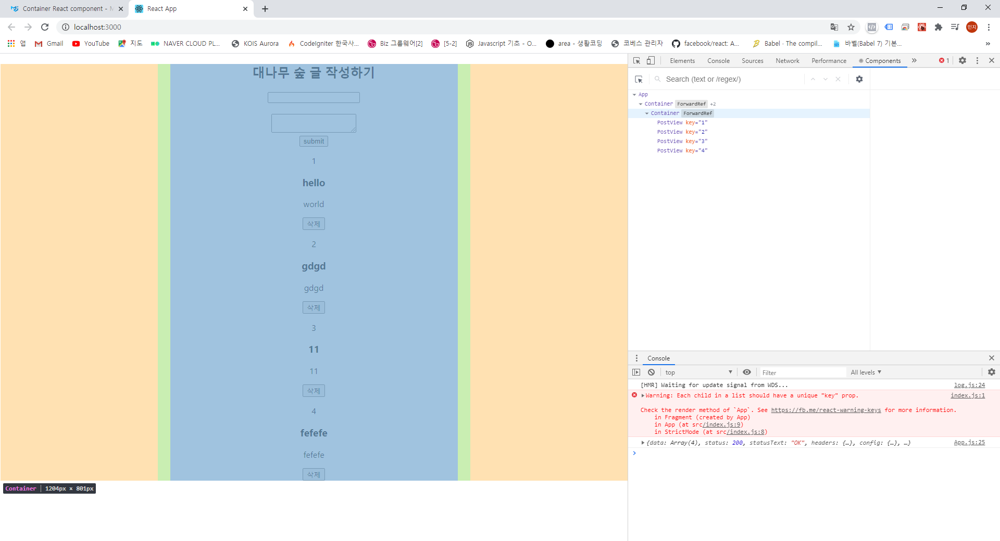

# react-django-app

(in my-app-dir)

```
npx create-react-app reactfontend
cd reactfrontend
npm install axios
npm audit fix
```

axios는 프로미스 기반의 http 클라이언트입니다. http통신, api로 하는 통신을 비동기로 처리할 수 있습니다.     
그리고 `api.js`파일을 만들고 `api`통신을 위한 함수들을 만듭니다.

```
import axios from "axios"

axios.defaoults.baseURL = "http://127.0.0.1:8000/api"

export default {
    //모든 글 불러오기
    getAllPosts() {
        return axios.get('/posts/')
    },

    // 글 작성하기
    createPost(data) {
        return axios.post('/posts/', data)
    },

}
```

그 후 `App.js`에 들어가서 문서를 수정해줍니다.      
그런데 `title`과 `content`의 이벤트를 모두 처리하는 함수를 만들려면 어떻게 해야할까요?  
첫번째 방법은
```
import React from 'react';
import './App.css';

class App extends React.Component {
  constructor(props) {
    super(props)
    this.state = {
      titie: '',
      content: '',
    }
  }

  // handlingChange = (event) => {
  //   this.setState({titie: event.target.value})
  // }
  handlingChange = (name) => (event) => {
    this.setState({[name]: event.target.value}) //이 부분
  }

  render() {
    return (
      <div className="App">
        <div className="PostingSection">
          <h2>대나무 숲 글 작성하기</h2>
          <input 
            name="title"
            value={this.state.title}
            onChange={this.handlingChange('title')} //이 부분
          />
          <br /><br />
          <textarea 
            name="content"
            value={this.state.content}
            onChange={this.handlingChange('content')} //이 부분
          />
        </div>
        <div className="ViewSection">

        </div>
      </div>
    );
  }
}

export default App;
```
두번째 방법은 

```
import React from 'react';
import './App.css';

class App extends React.Component {
  constructor(props) {
    super(props)
    this.state = {
      titie: '',
      content: '',
    }
  }

  // handlingChange = (event) => {
  //   this.setState({titie: event.target.value})
  // }
  // handlingChange = (name) => (event) => {
  //   this.setState({[name]: event.target.value})
  // }

   handlingChange = (event) => {
    this.setState({[event.target.name]: event.target.value}) //이부분
  }

  render() {
    return (
      <div className="App">
        <div className="PostingSection">
          <h2>대나무 숲 글 작성하기</h2>
          <input 
            name="title"
            value={this.state.title}
            onChange={this.handlingChange} //이부분
          />
          <br /><br />
          <textarea 
            name="content"
            value={this.state.content}
            onChange={this.handlingChange} //이부분
          />
        </div>
        <div className="ViewSection">

        </div>
      </div>
    );
  }
}

export default App;

```

그 후 `<form>`태그로 묶어줍니다.

```
import React from 'react';
import './App.css';
import api from './api'

class App extends React.Component {
  constructor(props) {
    super(props)
    this.state = {
      title: '',
      content: '',
    }
  }

  handlingChange = (event) => {
    this.setState({ [event.target.name]: event.target.value })
  }

  handlingSubmit = async (event) => { //동기
    event.preventDefault() //event의 기능 -> 막는다
    let result = await api.createPost({title: this.state.title, content: this.state.content})
    console.log("done!" + result);
  }

  render() {
    return (
      <div className="App">
        <div className="PostingSection">
          <h2>대나무 숲 글 작성하기</h2>
          <form onSubmit={this.handlingSubmit}>
            <input
              name="title"
              value={this.state.title}
              onChange={this.handlingChange}
            />
            <br /><br />
            <textarea
              name="content"
              value={this.state.content}
              onChange={this.handlingChange}
            />
            <br />
            <button type="submit">submit</button>
          </form>
      </div>
      <div className="ViewSection">

      </div>
      </div >
    );
  }
}

export default App;
```

그 후 `src` 폴더 안에 `Components`라는 폴더를 생성하고 `PostView.js`라는 파일을 생성합니다. `PostView.js`에 `rcc` 를 쓰고 엔터를 누르면 자동 컴포넌트를 생성합니다. (reactjs code snippets install 후 사용 가능)

`PostView.js`

```
import React, { Component } from 'react';

// const dummy_prop = {
//     title : ,
//     content: 
// }

class PostView extends Component {
    render() {
        const {title, content} = this.props
        return (
            <div>
                <h3>{title}</h3>
                <p>{content}</p>
            </div>
        );
    }
}

export default PostView;
```


`App.js`

```
import React from 'react';
import './App.css';
import api from './api'
import PostView from './Components/PostView'

class App extends React.Component {
  constructor(props) {
    super(props)
    this.state = {
      title: '',
      content: '',
      results: [],
    }
  }

  componentDidMount() {
    this.getPosts()
  }

  async getPosts() {
    const _results = await api.getAllPosts()
    // _results.data 아무것도 없음 비동기 때문 -> 동기화
    this.setState({results: _results.data})
    console.log(_results);
  }

  handlingChange = (event) => {
    this.setState({ [event.target.name]: event.target.value })
  }

  handlingSubmit = async (event) => { //동기
    event.preventDefault() //event의 기능 -> 막는다
    let result = await api.createPost({title: this.state.title, content: this.state.content})
    console.log("done!" + result);
  }

  render() {
    return (
      <div className="App">
        <div className="PostingSection">
          <h2>대나무 숲 글 작성하기</h2>
          <form onSubmit={this.handlingSubmit}>
            <input
              name="title"
              value={this.state.title}
              onChange={this.handlingChange}
            />
            <br /><br />
            <textarea
              name="content"
              value={this.state.content}
              onChange={this.handlingChange}
            />
            <br />
            <button type="submit">submit</button>
          </form>
      </div>
      <div className="ViewSection">
        {
          this.state.results.map((post) =>
        <PostView title={post.title} content={post.content} key={post.id} />
          )
        }
      </div>
      </div >
    );
  }
}

export default App;

```

delete를 하기위해서 

`App.js`에서
```
handlingDelete = async (event) => {
    await api.deletePost(event.target.value)
    this.getPosts()
  }
```

이렇게 작성하는데 동기로 만드는 이유는 delete하는 시간이 조금 더 느려 바로 결과가 안보이기 때문입니다.

그리고 `api.js`에서
```
    deletePost(id) {
        return axios.delete('/posts/' + String(id))
    }
```

이렇게 api를 axios를 통해 삭제할 수 있게 만들어줍니다.

그리고 삭제 버튼을 만들어줍니다.
```
<button value={post.id}  onClick={this.handlingDelete}>삭제</button>

```

이제 마지막으로 퍼블리싱 영역을 해볼건데, Material=UI를 사용해보겠습니다.

``` 
npm install @material-ui/core
```

[Material Ul] : https://material-ui.com/getting-started/installation/
이 페이지에 들어가면 `Roboto font`를 사용하는 법이 있습니다. 그 링크를 복사해서 `index.html`에 `header`에 붙여넣습니다.
그리고 `font icons`로 붙여넣습니다.     
그리고 이페이지에서 `Container`를 가져와 사용해보겠습니다.
```
import Container from '@material-ui/core/Container';
```
위 코드를 `App.js`에 붙여주고, 

`<div className="App">`다음에 `<Container maxWidth="sm">`를 붙여넣습니다.

 <br/>

이런식으로 css도 함께 꾸밀 수 있습니다.
