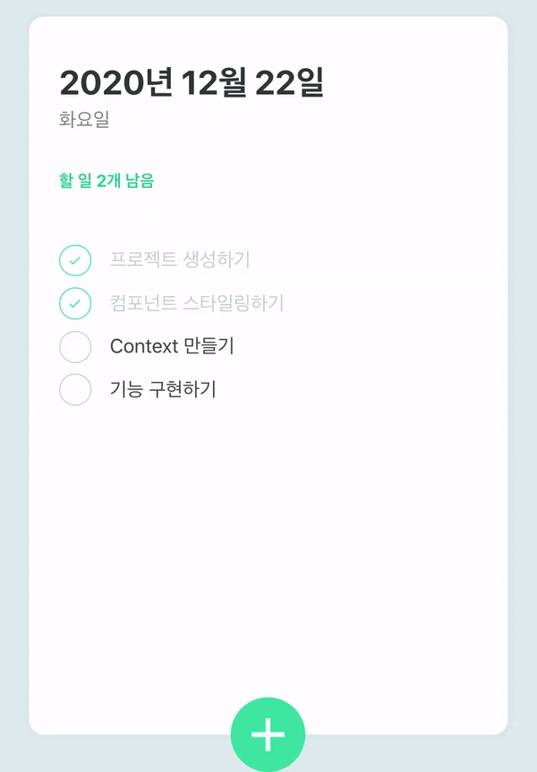
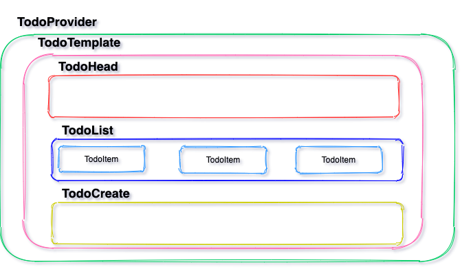
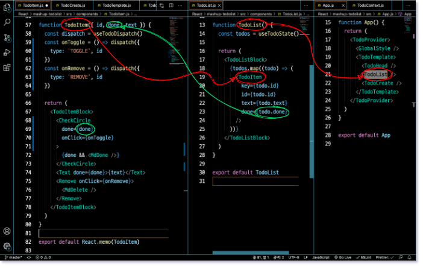

# React TodoList 만들기



## App.js

App.js

```js
...
const GlobalStyle = createGlobalStyle`
  body {
    background: #e0ecef;
  }
  `

function App() {
  return (
    <TodoProvider>
      <GlobalStyle />
      <TodoTemplate>
        <TodoHead />
        <TodoList />
        <TodoCreate />
      </TodoTemplate>
    </TodoProvider>
  )
}

export default App
```



## TodoHead.js

TodoHead.js

```js
...
function TodoHead() {
  const todos = useTodoState()
  const undoneTasks = todos.filter((todo) => !todo.done)

  const today = new Date()
  const dateString = today.toLocaleDateString('ko-KR', {
    year: 'numeric',
    month: 'long',
    day: 'numeric',
  })
  const dayName = today.toLocaleDateString('ko-KR', { weekday: 'long' })

  return (
    <TodoHeadBlock>
      <h1>{dateString}</h1>
      <div className="day">{dayName}</div>
      <div className="tasks-left">할 일 {undoneTasks.length}개 남음</div>
    </TodoHeadBlock>
  )
}

export default TodoHead
```

`undoneTasks` 는 남은 할 일의 개수를 담을 변수이다.

남은 할 일의 개수를 알기 위해서 `useTodoState`를 사용했는데, `useTodoState`는 `TodoContext.js` 따로 만든 커스텀 hook이다.

### useTodoState 구조

`TodoContext.js`에서 `useTodoState`의 구조를 보면

- 해당 리스트의 초기값과 reducer를 사용해서 state와 dispatch를 정의했다.

  - `const initialTodos = [ ... ]`
  - `function todoReducer(state, action) { case 'CREATE':, case 'TOGGLE':, case 'REMOVE' }`
  - `const [state, dispatch] = useReducer(todoReducer, initialTodos)

- 객체 멤버는 id, text, done이 있고, `TodoHead`에서 사용할 프로퍼티는 done이다.

- state와 dispatch를 각각 context로 사용하여 해당 객체의 상태(state)와 조건변화(dispatch)를 각각 필요한 것만 가져와서 사용할 수 있게 했다.

  - state custom context hook은 `useTodoState`로 `useContext(TodoStateContext)`를 리턴한다.

    - `const TodoStateContext = React.createContext()`
    - `<TodoStateContext.Provider value={state}>`
    - `export function useTodoState() { return useContext(TodoStateContext)}`

  - dispatch custom context hook은 `useTodoDispatch`로 `useContext(TodoDispatchContext)`를 리턴한다.
    - `const TodoDispatchContext = React.createContext()`
    - `<TodoDispatchContext.Provider value={dispatch}>`
    - `export function useTodoDispatch() { return useContext(TodoDispatchContext)}`

Todo State를 담고 있는 Context, `useTodoState`를 import해서 해당 State를 가져와서 사용할 수 있게 된다.

### undoneTasks

`useTodoState()`를 담은 변수 `todos`를 콘솔에 찍어 보면

```
Array(4)
0: {id: 1, text: "프로젝트 생성하기", done: true}
1: {id: 2, text: "컴포넌트 스타일링하기", done: true}
2: {id: 3, text: "Context 만들기", done: false}
3: {id: 4, text: "기능 구현하기", done: false}
length: 4
__proto__: Array(0)
```

이렇게 state를 확인할 수 있다.

또한 리스트를 추가, 삭제하면 다시

```
(5) [{…}, {…}, {…}, {…}, {…}]
0: {id: 1, text: "프로젝트 생성하기", done: true}
1: {id: 2, text: "컴포넌트 스타일링하기", done: true}
2: {id: 3, text: "Context 만들기", done: false}
3: {id: 4, text: "기능 구현하기", done: false}
4: {id: 5, text: "할 일 추가", done: false}
length: 5
__proto__: Array(0)
```

이렇게 업데이트가 반영되는 것을 볼 수 있다.

그리고 해당 배열 객체의 프로퍼티 `length`가 있는 것을 확인할 수 있고, 이를 사용하여 `undoneTasks`를 구할 수 있다.

```js
const undoneTasks = todos.filter((todo) => !todo.done)
```

filter()를 사용해서 done이 false인 객체만 가져온 배열을 undoneTasks에 담고, undoneTasks의 length로 남은 할 일의 개수를 나타낸다.

### date

`const today = new Date()` 로 Date객체를 생성한다.

그리고 `toLocaleDateString()`를 사용해서 1번째 인자(국가)에 따른 해당 today의 날짜 string화 한다.

그리고 `month`만 `long`인 것은 '2020년 12월 10일'와 같은 형태로 문자열을 만들기 위해서이다.  
`month` 또한 'numeric'이라면 '2020.12.10'와 같은 형태의 문자열이 만들어진다.  
영어로는 `month`가 `long`이면 `December`, `numeric`이면 `12`가 된다.

`toLocaleDateString()`으로 `weekday: 'long'` 을 넘겨주면 해당 요일을 문자열로 받을 수 있다.

## TodoList.js

TodoList.js

```js
function TodoList() {
  const todos = useTodoState()

  return (
    <TodoListBlock>
      {todos.map((todo) => (
        <TodoItem
          key={todo.id}
          id={todo.id}
          text={todo.text}
          done={todo.done}
        />
      ))}
    </TodoListBlock>
  )
}

export default TodoList
```

TodoItem.js

```js
function TodoItem({ id, done, text }) {
  const dispatch = useTodoDispatch()
  const onToggle = () =>
    dispatch({
      type: 'TOGGLE',
      id,
    })
  const onRemove = () =>
    dispatch({
      type: 'REMOVE',
      id,
    })

  return (
    <TodoItemBlock>
      <CheckCircle done={done} onClick={onToggle}>
        {done && <MdDone />}
      </CheckCircle>
      <Text done={done}>{text}</Text>
      <Remove onClick={onRemove}>
        <MdDelete />
      </Remove>
    </TodoItemBlock>
  )
}

export default React.memo(TodoItem)
```



### TodoItem(useTodoDispatch)

TodoItem은 `dispatch`가 필요하다. 변화(Toggle, Remove)에 해당하는 함수를 만들어야 한다.

TodoItem.js

```js
const dispatch = useTodoDispatch()
const onToggle = () =>
  dispatch({
    type: 'TOGGLE',
    id,
  })
const onRemove = () =>
  dispatch({
    type: 'REMOVE',
    id,
  })
```

위와 같은 함수 `onToggle`, `onRemove`를 `TodoContext.js`에서 만들어 놓은 reducer에서의 dispatch, `useTodoDispatch()`를 import해서 사용 한다.

TodoContext.js

```js
function todoReducer(state, action) {
  switch (action.type) {
    case 'CREATE':
      return state.concat(action.todo)
    case 'TOGGLE':
      return state.map((todo) =>
        todo.id === action.id ? { ...todo, done: !todo.done } : todo,
      )
    case 'REMOVE':
      return state.filter((todo) => todo.id !== action.id)
    default:
      throw new Error(`Unhandled action type: ${action.type}`)
  }
}
```

이렇게 만들어 놓은 함수를 `dispatch` case에 따라서 return 값을 받는다.

TodoItem.js

```js
<TodoItemBlock>
  <CheckCircle done={done} onClick={onToggle}>
    {done && <MdDone />}
  </CheckCircle>
  <Text done={done}>{text}</Text>
  <Remove onClick={onRemove}>
    <MdDelete />
  </Remove>
</TodoItemBlock>
```

여기서 각각 `id`, `done`, `onToggle`, `text`, `onRemove`를 받아 온다. `onToggle`과 `onRemove`는 위에서 만든 함수를, 나머지는 상위 component인 TodoList에서 params로 받는다.

그리고 <b>TodoList에서는 `useTodoState()`에서 state를 받아와서 map() 함수로 TodoItem에 배분해서 list를 나열한다.</b>

### TodoList(useTodoState, map)

TodoList.js

```js
<TodoListBlock>
  {todos.map((todo) => (
    <TodoItem key={todo.id} id={todo.id} text={todo.text} done={todo.done} />
  ))}
</TodoListBlock>
```

위에 `todos`는 `const todos=useTodoState()` 이다.

## TodoCreate.js

```js
function TodoCreate() {
  const [open, setOpen] = useState(false)
  const [value, setValue] = useState('')

  const dispatch = useTodoDispatch()
  const nextId = useTodoNextId()

  const onToggle = () => setOpen(!open)
  const onChange = (e) => setValue(e.target.value)
  const onSubmit = (e) => {
    e.preventDefault() // 새로고침방지
    dispatch({
      type: 'CREATE',
      todo: {
        id: nextId.current,
        text: value,
        done: false,
      },
    })
    setValue('')
    setOpen(false)
    nextId.current += 1
  }

  return (
    <>
      {open && (
        <InsertFormPositioner>
          <InsertForm onSubmit={onSubmit}>
            <Input
              autoFocus
              placeholder="할 일 입력 후, Enter"
              onChange={onChange}
              value={value}
            />
          </InsertForm>
        </InsertFormPositioner>
      )}
      <CircleButton onClick={onToggle} open={open}>
        <MdAdd />
      </CircleButton>
    </>
  )
}

export default React.memo(TodoCreate)
```

### useState(open, value)

`open`은 글쓰는 창을 열고 닫는 toggle 이기 때문에 initial 값을 false로 하고, `setOpen(!open)`으로 하면된다.

```js
const [open, setOpen] = useState(false)
const onToggle = () => setOpen(!open)
```

`value`는 input창에서 쓰는 값(value)를 담기 위한 변수이다.

태그의 속성도 `value`이고 state를 담은 변수도 `value`여서 헷갈릴 수 있다. 변수 `value`를 `value1`로 바꾸어보면,

```js
const [value1, setValue] = useState('')
const onChange = (e) => {
setValue(e.target.value)
console.log(e.target)
}
...
<Input
    autoFocus
    placeholder="할 일 입력 후, Enter"
    onChange={onChange}
    value={value1}
/>
```

위와 같이 `e.target`을 콘솔에서 보면 `<input ... value="">`이라고 뜬다.  
그렇기 때문에 `e.target.value`는 (`onChange()`함수에서 `setValue`로 바뀐 값인 `value1`을 받는) 태그 속성 `value`를 의미한다.

### onSubmit

TodoCreate.js

```js
const onSubmit = (e) => {
  e.preventDefault() // 새로고침방지
  dispatch({
    type: 'CREATE',
    todo: {
      id: nextId.current,
      text: value1,
      done: false,
    },
  })
  setValue('')
  setOpen(false)
  nextId.current += 1
}
```

`e.preventDefault()`는 submit을 하고 발생하는 새로고침을 방지한다.

`TodoContext.js`에서 reducer 함수에서 설정한 케이스 'CREATE'를 가져와서 사용하니까, `const dispatch = useTodoDispatch()`, `useTodoDispatch()`를 사용한다.

그리고 dispatch에서 사용할 id는 `const nextId = useTodoNextId()`, useTodoNextId()를 사용한다.
이것 또한 커스텀 hook으로 `TodoContext.js`에서 만들었고, `useRef()`를 사용했다. 그래서 `.current`를 사용해서 현재 값을 사용할 수 있다.

그리고 text는 `value1`을 받는다.

객체(`id`, `text`, `done`) 을 넘겨 'CREATE'에 해당하는 값을 반환받고,

TodoContext.js

```js
case 'CREATE':
    return state.concat(action.todo)
```

`setValue('')`로 값을 초기화하고, `setOpen(false)`로 토글을 false로 바꾼다. 그리고 nextId.current 를 하나 추가한다.

그리고 여기서 사용한 hooks에 자세한 설명은 [React/doc/hooks](https://github.com/gigibean/TIL/blob/master/React/doc/hooks/useContext_useReduce_useRef.md)를 다시 보면 된다.
