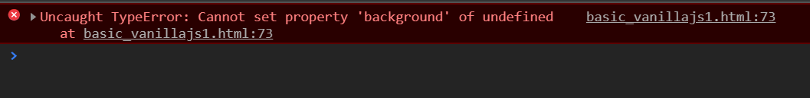
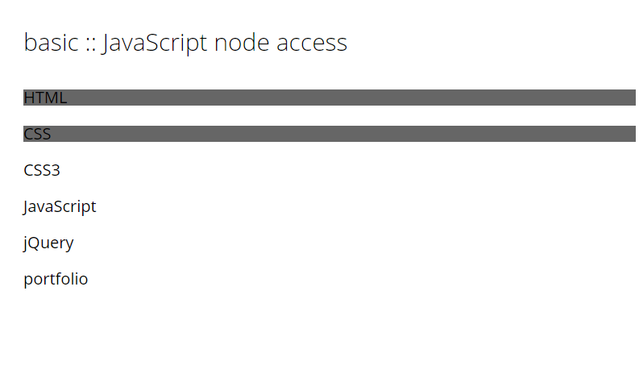

# DOM 요소

바닐라 js는 새로운 프레임워크가 아니라 커스터 마이징 하지 않은 순수한 형태의 자바 스크립트를 나타낸다. 매우 우수한 퍼포먼스를 가진다. 코딩에 따른 결과물이 브라우저에 브라우징 된다. jQuery에 의존해서 많이 사용해 왔다. js만으로 명령어를 작성하는 것에 익숙하지 않을 것이다. DOM에 관련된 내용을 보면

JQuery의 select 키워드 
```
$(“#header”);
```

JavaScript

```
document.getElementsByID();
document.getElementsByTagName();
```

***

## Vanilla JS 개발의 장단점
장점
    * 순수한 JavaScript로 구성할 수 있어 단순한 구조로 진행이 가능하다.
    * JavaScript 이외의 별도의 학습이 필요하지 않다.

단점
    * 필요한 기능에 대해 자체 개발이 필요하며 그에 따른 작업이 필요하다.
    * 지원 브라우저에 대한 이슈를 자체적으로 해결하는 것이 필요하다.
    * 개발자의 개발 수준에 따른 코드 품질 차이가 발생
    * 라이브러리나 프레임워크와 비교해서 같은 일정에 같은 코드 품질이 나오기 어렵다.   따라서 높은 수준의 결과물을 위해서 많은 개발 일정이 필요하다.

## JQuery의 장단점
장점
    * 라이브러리나 프레임워크를 사용한다면 다양한 기능을 어렵지 않게 구현할 수 있다.
    * 제공되는 기능을 토대로 개발 생산성이 증가된다.
    * 최적의 웹환경을 제공하기 위해 예외처리나 우회처리는 필수이며,    브라우저별 또는 브라우저 버전별 테스트가 수반되어야 한다.    이를 처리하기 위한 기능들이 제공되고 있다.
    * 구조화된 스크립트 방식을 통해 개발 품질 유지가 쉽다.
    * 제공되는 기능과 레퍼런스를 활용한다면 높은 수준의 결과물을 만들 수 있다.

단점
    * JavaScript에 대한 이해 뿐만 아니라 각각의 라이브러리나 프레임워크에 대한 별도 학습이 필요하다.
    * 전용 스크립트를 포함해야 하므로 상대적으로 스크립트 구조가 복잡해진다.
    * 라이브러리나 프레임워크방식에 따른 자체 해결방안이 필요하게 된다.

***

## DOM 요소 1

1. id 접근
getElementsById() 메서드는 지정된 값을 갖는 id 속성의 Element Object를 반환한다.
elements object는 일반적으로 직관할 수 있는 태그들을 의미한다.
document.getElementsByID()
return value: An Element Object
Element Object는 Node Object의 다른 유형이라고 할 수 있다. 단지 텍스트 노드와 주석과 같은 것은 Element Object에 포함되지 않는다.

활용 구문

```
var tutorial = document.getElementById(“tutorial”);
tutorial.style.background(Color = “#666”);
```
style은 Element Object의 스타일 리스트를 얻거나 작성할 수 있다.

2. class 접근
getElementsByClassName() 메서드는 지저오딘 클래스 이름을 가진 문서의 모든 요소를 NodeList Object로 반환한다.

3. tagname으로 접근

```
var li = document.getElementsByTagName(“li);
```

4. CSS 기법으로 노드에 접근

```
var li = document.querySelector("#tutorial > li");
li.style.background = "#666";
```

이런식으로 CSS처럼 노드 리스트에 접근하게 되면 전체 리스트에 요소에 적용되는 것이 아닌

 <br/>

이런식으로 첫번째 요소만 적용된다.

CSS 기법으로 전체 노드를 선택하기 위해서는 querySelectorAll() 메서드를 사용한다. 
그렇게 지정된 CSS 스타일과 일치하는 문서의 모든 요소를 정적 NodeList Object로 반환한다.
```
var li = document.querySelectorAll("#tutorial > li");
li.style.background = "#666";
```
위 같이 하면 Node Object 가 아니라 Node List Object가 얻어지기 때문에 error가 일어난다.
<br/> <br/>

for 문 같은 것으로 파싱해주어야 한다.
```
var li = document.querySelectorAll("#tutorial > li");
for (var i = 0; i < li.length; i++) {
    li[i].style.background = "#666";
}
```
<br/> <br/>

### li[i].textContent == li[i].innerText
```
var li = document.querySelector("#tutorial >li");
for (var i = 0; i < li.length; i++) {
    if(li[i].textContent == "HTML" || li[i].textContent == "CSS") {
        li[i].style.background = "#666";
    }
}
```
<br/> <br/>

getElementBy 방식이 CSS 보다 빠르나, CSS는 방식은 쉽다.

6. 상위 노드에 접근
parentNode 속성은 지정된 노드의 부모 노드를 Node object로 반환한다.
node.parentNode

node object를 반환한다

```
var html = document.querySelector(“.html”);
var contUI - html.parentNode;
console.log(conUI);
```

7. 상위 HTML 노드에 접근
parentElement 속성은 지정된 요소의 Element object를 반환한다.

node.parentElement
element object를 반환한다.

### node object와 element object 의 차이점
W3C의 DOM(Document Object Model) 스펙에 따르면,
노드 인터페이스(Node Interface)는 DOM의 가장 기본이 되는 데이터 타입이다.

노드 인터페이스를 구현한 여러 오브젝트가 있으며, 노드 타입으로 구분할 수 있다. 
  예) 엘리먼트 노드, 텍스트 노드, 속성 노드 등등

정리: 노드는 엘리먼트의 상위 개념이다.

```
var html = document.querySelector(".html");
var contUl = html.parentElement;
console.log(contUl);
```

<br/> <br/>

8. 하위 노드에 접근
chileNodes 속성은 노드의 자식 노드 컬렉션을 nodeList object로 반환한다.
```
var cont = document.querySelector("#tutorial");
var contLi = cont.childNodes;
console.log(contLi);
```
<br/> <br/>

9. 하위 요소에 접근
```
var cont = document.querySelector("#tutorial");
var contLi = cont.children;
console.log(contLi);
```
<br/> <br/>

10. 하위 처음 노드에 접근
```
var cont = document.querySelector("#tutorial");
var firstLi = cont.firstChild;
console.log(firstLi);
```
<br/> <br/>

11. 하위 처음 요소에 접근
```
var cont = document.querySelector("#tutorial");
var firstLi = cont.firstElementChild;
console.log(firstLi);
```
<br/> <br/>

12. 이전 노드에 접근
previousSibling 속성은 동일한 트리 순서에서 지정된 노드의 이전 노드를 반환한다.
node.previousSibling

Node Object를 리턴한다.

> 노드를 셀렉트해서 접근
>   >   ```
    var css = document.querySelector(“.css”); // a node object
    var previous = css.previousSibling;
    console.log(previous);
    ```

> 노드 리스트에 0번 째 값에 접근
>   >    ```
    var css = document.getElementByClassName("css"); //a nodeList Object
    var previous = css[0].previousSibling;
    console.log(previous);
    ```


    

