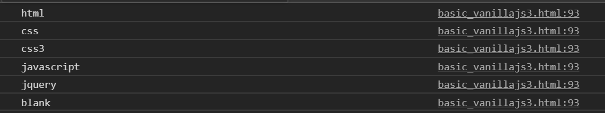
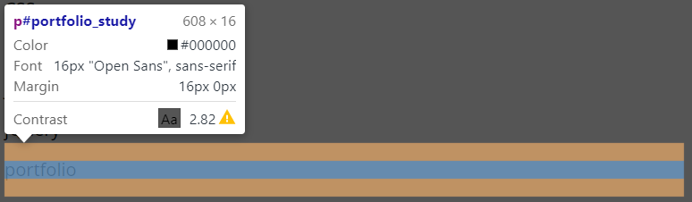
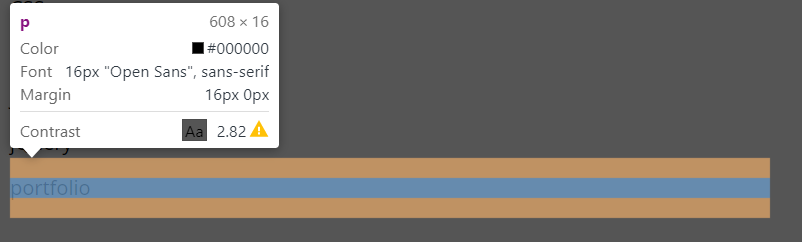
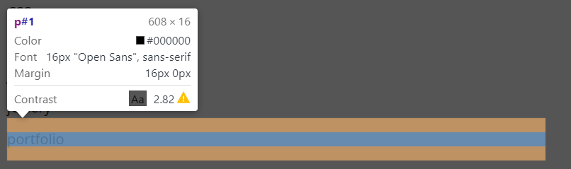

# 노드의 속성 접근 및 변경

## tagName
```
<li class='html>HTML</li>
```

```
var html = document.querySelector(".html");
var tagName = html.tagName;
console.log(tagName);
```

태그 네임은 대문자로 표시 됩니다.
 <br/>

## get set 방식
```
var container = document.querySelector("#tutorial");
var id = container.id;
console.log(id); //tutorial
container.id = "tutorial2"; 
console.log(container.id); //tutorial2
```

## 노드클래스 이름 속성
className 속성은 요소의 클래스 이름(요소의 클래스 특성 값)을 설정하거나 반환합니다.
element.className

문자열로 반환됩니다.

```
var li = document.querySelectorAll("#tutorial li");
for(var i = 0; i < li.length; i++) {
    if(li[i].className == "html") {
        li[i].style.backgroundColor = "#555";
    }
}
```
문자열 자를 때 slice(firstIndex, lastIndex);
문자열 들어있는지 찾을 때 indexOf(String);

## 노드의 속성 읽기
getAttriute() 메서드는 요소의 지정된 이름을 가진 속성의 값을 반환합니다.
element.getAttribut(attributeName)

문자열을 반환합니다.

```
var liList = document.querySelectorAll("#tutorial > li");
for (var i = 0; i < liList.length; i++) {
    var className = liList[i].getAttribute("class");
    console.log(clasName);
}
```
<br/> <br/>

## 노드의 속성 변경
setAtrribute() 메서드는 지정된속성을 요소에 추가하고 지정된 값을 지정합니다.
element.setAttribute(attributename, attributevalue);

반환 되는 값은 없습니다.

```
var p = document.querySelectorAll("p");
for (var i = 0; i < p.length; i++) {
    if(p[i].textContent == "portfolio") {
        p[i].setAtrribute("id", "portfolio_study");
    }
}
```
<br/> <br/>

## 노드의 속성 제거
removeAttriute() 메서드는 요소에서 지정된 속성을 제거합니다.
element.removeAttribute(attributename);

반환되는 값은 없습니다.

```
var p = document.querySelector("p");
for (var i = 0; i < p.length; i++) {
    if (p[i].textContent == "portfolio") {
        p[i].removeAttribue("id");
    }
}
```
<br/> <br/>

## 노드의 속성이 있는지 점검
hasAttribute() 메서드는 지정된 속성이 있으면 true를 반환하고, 그렇지 않으면 false를 반환합니다.
element.hasAttribute(attributename);

boolean 값이 반환됩니다.

```
var p = document.querySelectorAll("p");
for (var i = 0; i < p.length; i++) {
    p[i].setAtrribut("id". i);
}
```

<br/> <br/>

##  liList[2] == liLst.item(2)

 ```
var liList = document.querySelectorAll("#tutorial > li ");
liList[2].style.backgroundColor = "#444";
liList.item(2).style.backgroundColor = "#451";
```
<br/> <br/>