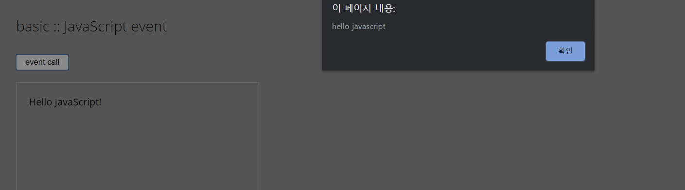
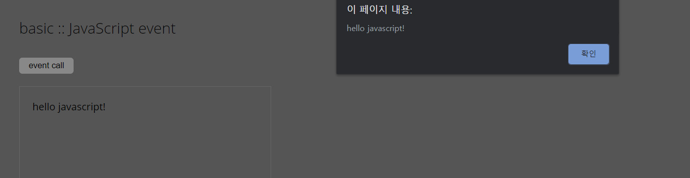
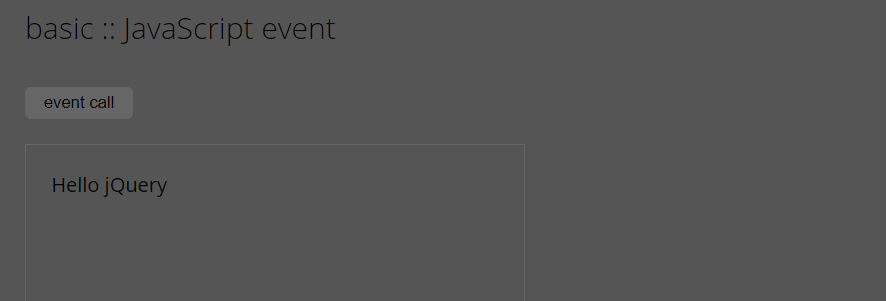

# DOM 이벤트 1

## 인라인 방식
초창기 인터넷 넷스케이프 당시부터 사용하던 이벤트 방식. 
전동적인 방법으로 오랫동안 사용해와서 많은 사람들이 아직도 사용하고 있습니다.
하지만 html을 문서로서 최적화하기 위해, html은 오로지 document를 표시해주는 역할을 담당하기 위해서는
이벤트 헨들러를 연결하는 것이 좋은 방법입니다.

```
<div class=”container”>
    <button id=”call” onclick=”writeTxt()”>event call</button>
    <textarea id=”demo” class=”note”></textarea>
</div>

<script>
function writeTxt() {
    var area = document.querySelector(“.note”);
    // area.innerHTML = “hello JavaScript”;
    // area.textContent = "hello JavaScript"
    area.innerText = “hello JavaScript”;
    alert("Hello world!");
}
</script>
```
<br/> <br/>

```
<div>
    <button id = "call" onclick="writeTxt('hello JavaScript!')">event call</button>
    <textrea id = "demo" class = "note"></textarea>
</div>
<script>
    function writeTxt(str) {
        var area = document.querySelector(".note");
        area.innerText = str;
        alert(str);
</script>
}
```
<br/> <br/>

## 속성 방식
MVC HTML 패턴에 맞게 함수콜 콜백 함수 형태(Listener, 리스너)로 만듭니다.
콜백 함수는 대입 형식의 함수 형식입니다.
이 타입의 이벤트를 지양하는 이유는 중복된 이벤트의 실행이 되지 않기 때문입니다.
```
var writeTxt = function(str) {
    var area = document.querySelector(".note");
    alert(str);
}
```

## 지향하는 코드 방식
지향하는 방식은 html 코드는 도드대로, script파일은 그대로 해서 코드를 분리시키는 것입니다.
onclick onload 메서드를 html 파일에 넣지 않고 파일을 따로 관리할 수 있습니다.
그러나 치명적인 단점은 중복 find가 되지 못한다는 것입니다.

```
window.onload = function() {
    var btn = document.querySelector("#call");
    var area = document.querySelector(".note");

    btn.onclick = function() {
        area.innerText = "hello JavaScript";
    }
    btn.onclick = function() {
        area.innerText = "hellow jQuery";
    }
}
```
<br/> <br/>

위 결과처럼 중복된 함수를 처리할 수 없습니다.