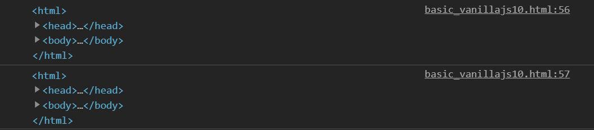
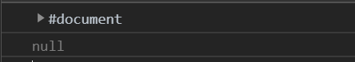
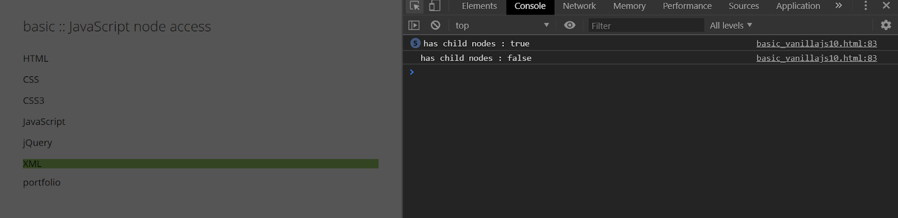
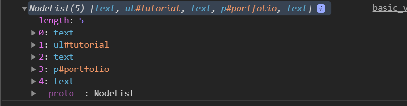
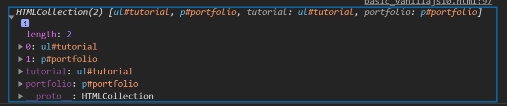
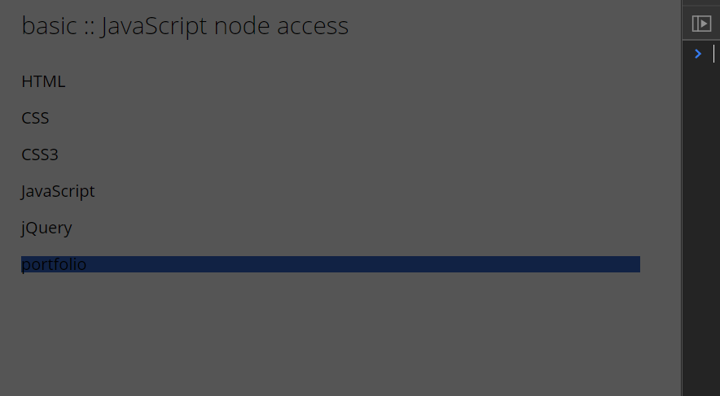
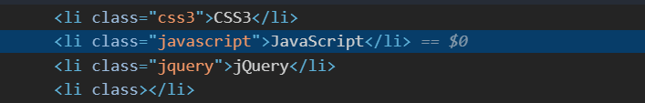
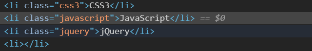

# DOM 요소 - 2

## 상위 노드에 접근
parentNode 속성은 지정된 노드의 부모 노드를 Node 객체로 반환 합니다.
node.parentNode

node Object로 반환됩니다.

## 상위 html 노드에 접근
parentElement 속성은 지정된 요소의 부모 요소를 반환합니다.
node.parentElement
element Object로 반환 됩니다.

```
winddow.addEventListener("load", function() {
    var liList = document.querySlelectorAll("#tutorial >li");
    
    for (var i = 0; i <liList.length; i++) {
        liList[i].addEventListener("click", function(e) {
            var il = e.target.parentElement;
            console.log(ul.getAttribute("id"));
            ul.style.backgroundColor = #487";
        });
    }  
    var bodyNode = document.querySelector("body");
    console.log(bodyNode.parentElement);
    console.log.(bodyNode.parentNode);
})
```
<br/> <br/>

onload 되어야지만 함수가 호출될 때 parentNode parentElement 를 가져올 수 있ㅅㅂ니다.
그렇지 않으면 undefined 됩니다.

```
winddow.addEventListener("load", function() {
    var liList = document.querySlelectorAll("#tutorial >li");
    
    for (var i = 0; i <liList.length; i++) {
        liList[i].addEventListener("click", function(e) {
            var il = e.target.parentElement;
            console.log(ul.getAttribute("id"));
            ul.style.backgroundColor = #487";
        });
    }  
    var bodyNode = document.querySelector("body");
    console.log(bodyNode.parentElement.parentNode);
    console.log.(bodyNode.parentNode.parentElement);
})
```
<br/> <br/>
node 만 상위 접근 가능합니다.

## 노드의 텍스트 내용 읽고 쓰기
innerText 속성은 지정된 노드의 텍스트 내용을 설정하거나 반환합니다.
node.textContent
node.innerText

문자열을 만환합니다.

## 노드의 html 내용 읽고 쓰기
innerHTML 속성은 요소의 html 내용(내부 html)을 설정하거나 변환합니다.
HTMLElementObject.innerHTML
문자열을 반환합니다.

## 하위 노드 여부 
```
var liList = document.querySelectorAll("#tutorial li");
for (var i = 0; i <liList.length; i++) {
    // 마지막 false는 분지점 5개의 (하위 노드) true 이후 1개의 false 리턴
    if (!liList[i].hasChildNoes()) {
        liList[i].innerHTML = "XML";
        liList[i].style.backgroundColor = "#243";
    }
}
```
<br/> <br/>

## 처음 하위 노드에 접근
firstChild 속성은 지정된 도드의 첫번째 자식 노드를 Node 객체로 반환합니다.
```
var tutorial = document.querySelector("#tutorial");
console.log(tutorial.firstChild);
```
<br/> <br/>
firstChild 는 node Ojbecjt를 반환합니다. (공백 오브젝트인 #text 반환) 1개

```
var tutorial = document.querySelector("#tutorial");
console.log(tutorial.firstElementChild);
```
<br/> <br/>
firstElementChild 는 element Object를 반환합니다.

## 하위 노드에 접근
```
var container = document.querySlelector(".container");
console.log(container.childNodes);
```
<br/> <br/>
childNodes 는 node Object를 반환합니다. (공백을 포함합니다.)

```
var container = document.querySelector(".container");
console.log(container.children);
```
<br/> <br/>
children은 element Object를 반환합니다.

```
var contianer = document.querySelector(".container");
var cintChildren = container.children;
for (var i = 0; i < contChildren.length; i++) {
    if (contChildren[i].tagName == "P") { //대문자로 되어 있어야 합니다.
        contChildren[i].style.backgroundColor = "#124";
    }
}
```
<br/> <br/>

## 노드의 속성 제거

```
window.addEventListener("load", function() {
    var liList = document.querySelectorAll("#tutorial li");
    for (var i = 0; i < liList.length; i++) {
        var className = liList[i].getAttribute("class");
        console.log(className);
        if(className == "blank") {
            // liList[i].setAttribute("class", "ajax");
            // liList[i].removeAttribute("class");
            liList[i].classList.remove("blank");
        }
    }
});
```
이와 같은 바법으로 클래스에서 blank라는 것을 지워 줍니다.
<br/> <br/>

```
window.addEventListener("load", function() {
    var liListt = document.querySelectorAll("#tutorial li");
    for (var i = 0; i < liList.length; i++) {
        var className = liList[i].getAttribute("class");
        console.log(className);
        if(className == "blank") {
            liList[i].removeAttribuet("class");
        }
    }
});
```
위와 같은 방법은 class 자체를 지웁니다.
<br/> <br/>

## 새로운 노드를 생성
node createElement();
element object를 반환합니다.

## 노드에 생선된 새로운 노드 추가
appendChild() 메서드는 노드를 노드의 마지막 자식으로 추가합니다.
node.appendChild(node)
node Object를 반환합니다.

```
var tutorial = document.querySelector("#tutorial");
var ajax = document.createElement("LI");
ajax.setAttribute("class", "ajax");
ajax.innerText = "AJAX";
toturial.appandCHhild(ajax); //실제화면 렌더링
```
<br/> <br/>