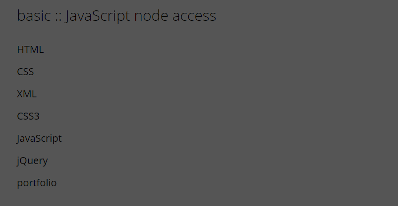
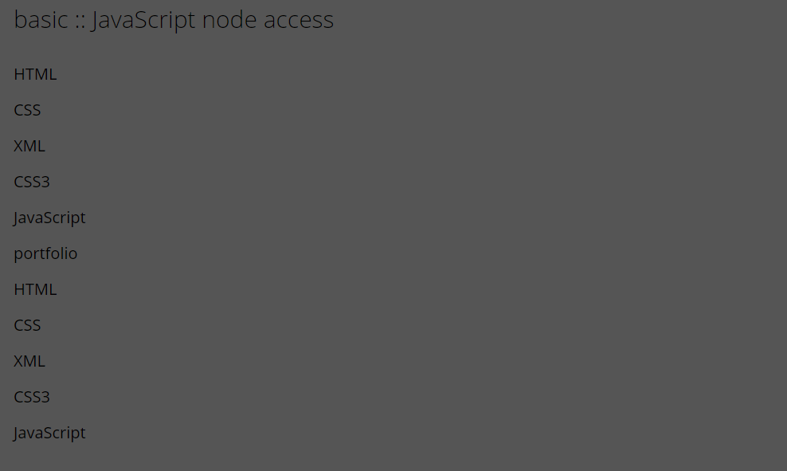
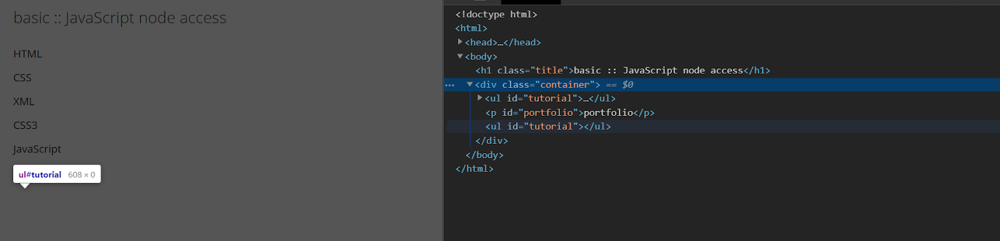

# DOM 요소 - 3

## 노드에 생선된 새로운 노드를 기준 노드 위치 이전 위치에 추가
insertBefore() 메서드는 노드를 자식으로 사용자가 지정하는 기존 자식 바로 앞에 추가합니다.
node.inserBefore(newNode, existingNode)
node Object를 반환합니다.

```
<script>
    window.addEventListener("load", function() {
        var xml = document.createElement("li");
        xml.setAtrribute("class", "xml");
        xml.innerText = "XML";

        var container = document.querySelector(".container");
        var tutorial = document.querySelector("#tutorial");
        var css3 = document.querySelector(".css3");
        tutorial.insertBefore(xml, css3);
    });
</script>
```
<br/> <br/>

## 노드 삭제
removeChild() 메서드는 지정된 요소의 지정된 자식 노드를 제거합니다.
node.removeChild(node)
node Object를 반환합니다.

## 노드 복제
```
var clone = tutorial.cloneNode(true); //true: 하위 노드도 같이 복제
container.appendChild(clone);
```
<br/> <br/>

```
var clone = tutorial.cloneNode(false);
container.appendChild(clone);
<br/> <br/>

