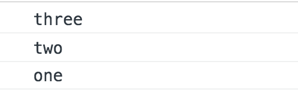
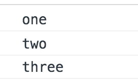

# 이벤트

## dblclick
dblclick은 더블 클릭을 의미합니다.
```
window.addEventListener("load", function() {
    var ball = document.querySelector(".ball");
    //ball.addEventListener("click", function(e) {
    ball.addEventListener("dblclick", function(e) { 
        e.target.classList.add("effect", "status");
    })
})
```
## mouseenter vs. mouseover & mouseleave vs. mouseout
mouseenter & mouseleave 는 bubbling x
mouseover & mouseout 은 bubbling o

## focus vs. focusin & blur vs. focusout
focus & blur 는 bubbling x
fucusin & focusout 는 bubboling o

## e.target.value
e.target.value는 input값을 변경합니다.

***

## Event Bubbling
이벤트 버블링은 특정 화면 요소에서 이벤트가 발생했을 때 해당 이벤트가 더 상위 화면 요소들로 전달되어 가는 
특성을 의미합니다. 

ex) div -> body

### 상위의 화면 요소란
HTML 요소는 기복적으로 트리 구조를 갖습니다.
여기에서는 트리 구조상으로 한 단계 위에 있는 요소를 상위 요소라고 합니다.

```
<body>
	<div class="one">
		<div class="two">
			<div class="three">
			</div>
		</div>
	</div>
</body>

HTMLCopy
var divs = document.querySelectorAll('div');
divs.forEach(function(div) {
	div.addEventListener('click', logEvent);
});

function logEvent(event) {
	console.log(event.currentTarget.className);
}
```
<br/>
위 코드는 세 개의 div 태그에 모두 클릭 이벤트를 등록하고 클릭했을 때 logEvent 함수를 실행시키는 코드입니다.
여기서 최하위 div 태그

```
<div class="three"></div>
```

를 클릭하면 아래와 같은 결과가 실행됩니다.

<br/> <br/>

div 태그 한개만 클릭했을 뿐인데 왜 3개의 이벤트가 발생되는 걸까요?   
그 이유는 브라우저가 이벤트를 감지하는 방식 때문입니다.   
브라우저는 특정 화면 요소에서 이벤트가 발생했을 때 그 이벤트를 최상위에 있는   
화면 요소까지 이벤트를 전파시킵니다.   
따라서, 클래스 명 three -> two -> one 순서로 div 태그에   
등록된 이벤트들이 실행됩니다.   
마찬가지로 two 클래스를 갖는 두 번째 태그를 클릭했다면 two -> one 순으로 클릭 이벤트가 동작하겠죠.   
<br/>
각 태그마다 이벤트가 등록되어 있기 때문에 상위 요소로 이벤트가 전달되는 것을 
확인 할 수 있습니다.   
만약 이벤트가 특정 div 태그에만 달려 있다면 위와 같은 동작 결과는 확인할 수 없습니다.   
<br/>
이와 같은 하위 에서 상위 요소로의 이벤트 전파 방식을
이벤트 버블링(Evenet Bubbling)이라고 합니다.   

***

## Event Capture
이벤트 캡처는 이벤트 버블링과 반대 방향으로 진행되는 이벤트 전파 방식입니다.   

특정 이벤트가 발생했을 때 최상위 요소인 body 태그에서 해당 태그를 찾아 내려갑니다.   
그럼 이벤트 캡처는 코드로 어떻게 구현할 수 있을까요?   

```
<body>
	<div class="one">
		<div class="two">
			<div class="three">
			</div>
		</div>
	</div>
</body>


var divs = document.querySelectorAll('div');
divs.forEach(function(div) {
	div.addEventListener('click', logEvent, {
		capture: true // default 값은 false입니다.
	});
});

function logEvent(event) {
	console.log(event.currentTarget.className);
}
```

addEventListener() API에서 옵션 객체에 capture: true를 설정해주면 됩니다.
그러면 해당 이벤트를 감지하기 위해 이벤트 버블링과 반대 방향으로 탐색합니다.
<br/>
따라서 아까와 동일하게 

```
<div class="three"></div>
```

를 클릭해도 아래와 같은 결과가 나타납니다.

<br/> <br/>
