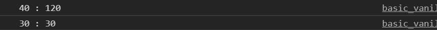

# offset

```
var ball - document.querySelector(".ball");
var body = docudment.body;
var x = ball.offsetLeft;
var y = ball.offsetTop;
console.log(x + " : " + y);

var w = ball.offsetWidth;
var h = ball.offsetHeight;
console.log(w + " : " + h);
```

<br/> <br/>

## offsetTop
offsetTop 속성은 offsetParent 요소의 위쪽을 기준으로 위쪽 위치 (픽셀)을 반환합니다.
반환 된 값은 다음과 같습니다.
* 요소의 상단 위치와 여백
* offsetParent 요소의 상단 패딩, 스크롤 막대 및 테두리

```
<!DOCTYPE html>
<html>
<head>
<style>
body {
  margin: 0;
  font-size: 28px;
}

.header {
  background-color: #f1f1f1;
  padding: 30px;
  text-align: center;
}

#navbar {
  overflow: hidden;
  background-color: #333;
}

#navbar a {
  float: left;
  display: block;
  color: #f2f2f2;
  text-align: center;
  padding: 14px 16px;
  text-decoration: none;
  font-size: 17px;
}

#navbar a:hover {
  background-color: #ddd;
  color: black;
}

#navbar a.active {
  background-color: #4CAF50;
  color: white;
}

.content {
  padding: 16px;
}

.sticky {
  position: fixed;
  top: 0;
  width: 100%
}

.sticky + .content {
  padding-top: 60px;
}
</style>
</head>
<body onscroll="myFunction()">

<div class="header">
  <h2>Scroll Down</h2>
  <p>Scroll down to see the sticky effect.</p>
</div>

<div id="navbar">
  <a class="active" href="javascript:void(0)">Home</a>
  <a href="javascript:void(0)">News</a>
  <a href="javascript:void(0)">Contact</a>
</div>

<div class="content">
  <h3>Sticky Navigation Example</h3>
  <p>
  가나다라마바사아자차카타파하하하가나다라마바사아자차카타파하하하가나다라마바사아자차카타파하하하가나다라마바사아자차카타파하하하가나다라마바사아자차카타파하하하가나다라마바사아자차카타파하하하가나다라마바사아자차카타파하하하가나다라마바사아자차카타파하하하가나다라마바사아자차카타파하하하가나다라마바사아자차카타파하하하가나다라마바사아자차카타파하하하가나다라마바사아자차카타파하하하가나다라마바사아자차카타파하하하가나다라마바사아자차카타파하하하가나다라마바사아자차카타파하하하가나다라마바사아자차카타파하하하가나다라마바사아자차카타파하하하가나다라마바사아자차카타파하하하가나다라마바사아자차카타파하하하가나다라마바사아자차카타파하하하가나다라마바사아자차카타파하하하가나다라마바사아자차카타파하하하가나다라마바사아자차카타파하하하가나다라마바사아자차카타파하하하가나다라마바사아자차카타파하하하가나다라마바사아자차카타파하하하
  </p>
</div>

<script>
var navbar = document.getElementById("navbar");
var sticky = navbar.offsetTop;

function myFunction() {
  if (window.pageYOffset >= sticky) {
  navbar.classList.add("sticky")
  } else {
  navbar.classList.remove("sticky");
  }
}
</script>

</body>
</html>
```
<br/>

### window.pageYOffset
window. 인터페이스의 pageYOffset 읽기 전용 속성은 scrollY의 다른 이름으로, 문서가 수직으로 얼마나 스크롤 됐는지 픽셀 단위로 반환합니다.
일부 오래된 브라우저는 scrollY 대신 pageYOffset 만 지원하는 경우가 있지만, 이러한 환경을 신경쓰지 않는다면 둘 중 아무거나 사용해도 됩니다.
스평 스크롤을 나타내는 pageXOffset 속성 역시 scrollX의 다른 이름입니다.
<br/>


## offsetLeft
HTMLElement.offsetLeft 읽기 전용 속성은 현재 요소의 왼쪽 위 모소리가 HTMLElement.offsetParent 노드 내에서 왼쪽으로 오프셋 된 픽셀 수를 반환 합니다.
<br/>
블록 레벨 요소의 경우 offsetTop, offsetLeft, offsetWidth, offsetHeight 는 연관된 offsetParent를 기준으로 요소이 border box를 설명합니다.
<br/>
그러나 인라인 레벨 요소(span 같은 경우)는 offsetTop과 offsetLeft이 첫 border box(이것의 width 와 height를 얻기 위해서 Element.getClientRects()를 사용한다)의 포지션을 설명하는데, offsetWidth와 offsetHeight는 bounding border box(이것의 포지션을 구하기 위해서는 Element.getBoundingClientRect()랄 사용한다)를 설명합니다. 그러므로, offsetLeft, offsetTop, offsetWidth, offsetHeight 의 (박스의) left, top, width, height는 텍스트를 감싸고 있는 span의 bounding box가 되지 못합니다.
<br/>

```
left = element.offsetLeft;
```

left는 가까운 relative 속성의 부모요소로부터의 떨어진 left값을 pixel로 받습니다.
<br/>

## offsetWidth (height)

element.offsetWidth는 margin을 제외한 padding 값, border 값과 vertical scrollbar (rendering된다면)까지 계산한 값을 가져옵니다.그리고 이요소는 ::before 과 ::after 같은 가상요소의 width를 포함하지 않습니다.
<br/>
그리고 이 요소가 hidden 이나 none이라면 0을 리턴합니다.
<br/>
offsetWidth는 border값과 scrollbar 값을 포함하여 리턴합니다.(크롬기준 스크롤바 17px입니다.)
<br/>

## element.clientWidth (height)

element.clientWidth 는 인라인 요소거나 css가 적용되지 않은 요소에는 0을 반환합니다. 
element.clientWidth는 요소의 inner width를 가집니다. 이는 paddiing은 포함하지만 border과 margin그리고 vertical scrollbar는 포함하지 않습니다. <br/>
clientWidth가 root 요소일 때 (<html>, <body> 요소와 같이), 스크롤바가 포함되지 않은 viewport의 width를 반환합니다.
이 프로퍼티는 정수와 가까운 값을 반환합니다. 만약 소수점자리까지 원하신다면 element.getBoundingClientRect()를 사용하세요.
<br/>
이 프로퍼티는 border와 scrollbar 값을 제외하고 값을 반환합니다.
<br/>

## element.scrollWidth (height)

element.scrollWidth (height)는 스크롤 영역일 때 스크롤로 감싸여진 내용의 전체 크기를 가져옵니다.
스크롤로 가져린 스크롤 내부의 컨텐츠의 전체 크기를 가져옵니다.

## element.getBoundingClientRect();
이 메서드는 element의 사이즈와 viewport와 연관되어 있는 이 요소의 포지션을 반환합니다.

보통 사용하는 평범한 박스 모델일 경우 이 요소의 사이즈는 width(height) + padding + border + border-width 와 같습니다.
만약에 box-sizing : border-box 인경우만 width(height) 를 반환합니다.
<br/>
반환되는 값은 요소와 관련된 css 보더 박스에 대해 getClientRects()에 의해 반환된 사각형의 합집합인 DOMRect object 입니다. 결과는 전체 테두리 상자를 픽셀 단위로 설명합니다.
top, left, right, bottom, x, y, 너비 및 높이 속성과 함께 전체 요소를 호함하는 가장 작은 사각형입니다. 너비와 높이 이외의 속송은 뷰포트의 왼쪽 위를 기준으로 합니다.
<br/>
빈 border-box는 완전히 무시됩니다. 만약에 모든 요소의 border-box가 비었다면, 사각형은 width와 height를 0으로 반환하게 됩니다. 그리고 top과 left는 요소의 첫 css 박스의 border-box의 왼쪽 위가 됩니다.

스크롤이 가능한 요소라면 viewport 영역에서 스크롤링이 수행된 스크롤 양이 고려됩니다. 이 말은 사각현의 경계(top, right, bottom, left)의 값이 스크롤링 포지션이 바뀔 때마다 사각형의 경계 값들도 변경됩니다. 왜냐하면 그들의 값은 absolute 가 아니라 viewport에 relative 되어 있기 때문입니다.
<br/>
만약 문서의 왼족 위에 relative된 bounding 사각형이 필요하다면 그저 최근 top과 left 프로퍼티들 추가해주면됩니다. (window.scrollX와 window.scrollY를 이용해서) 그럼 scrolling position에서 독립적인 bounding rectangle을 얻을 수 있습니다.